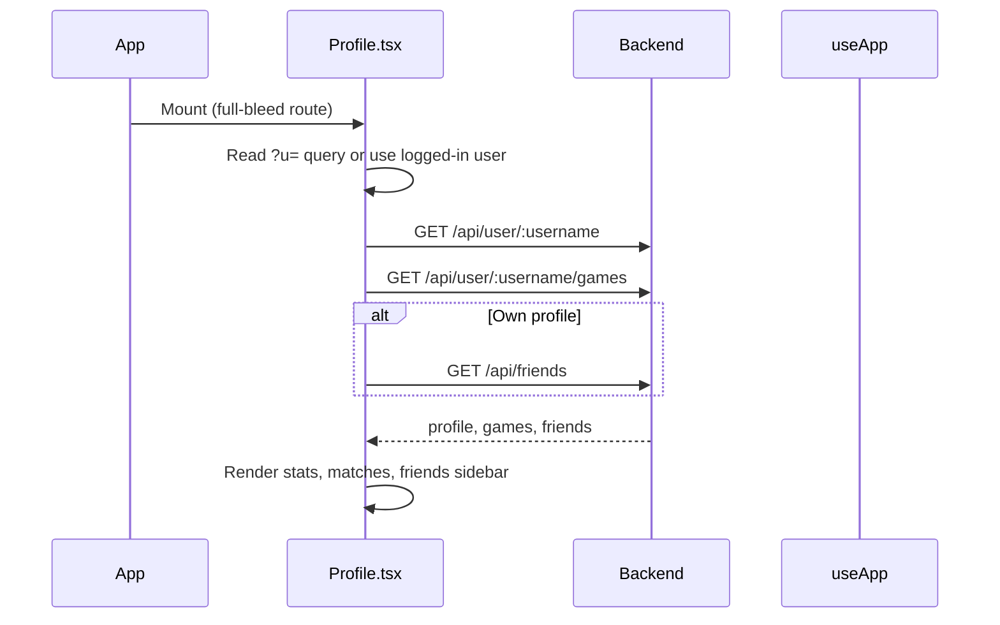
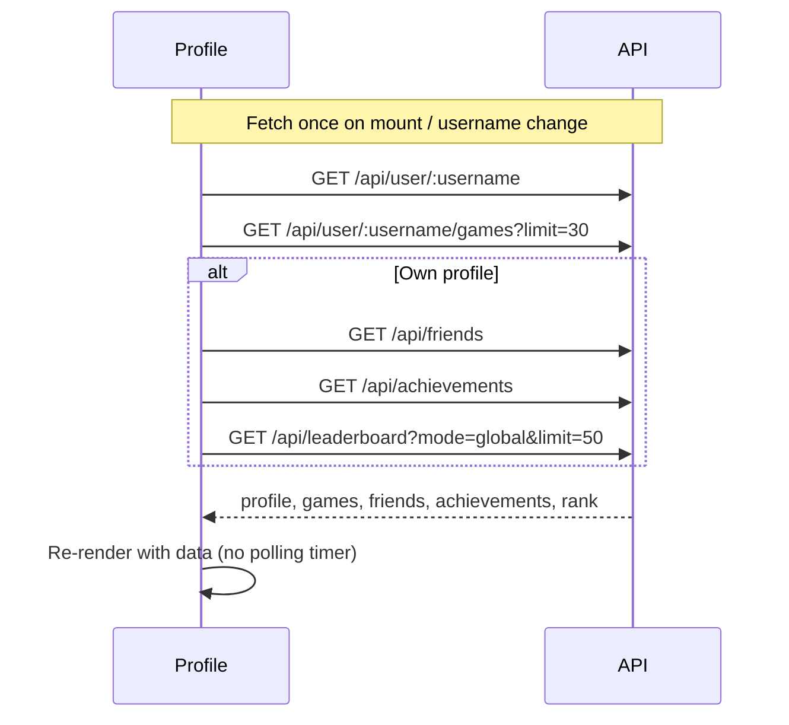

# Frontend — Profile Page

## Table of Contents

- [Overview](#overview) — User profile with stats, match history, and friends sidebar
- [Files](#files) — Source file inventory
- [Key Types / Interfaces](#key-types--interfaces) — Profile, match history, and friend types
- [Core Logic / Flow](#core-logic--flow) — Data fetching and presence polling
- [Dependencies](#dependencies) — Internal and external dependencies

---

## Overview

The Profile page (`/profile`) displays a user's public profile with statistics, recent match history, and a friends sidebar. It is a full-bleed route (rendered directly, no Shell wrapper; the page provides its own `RetroNavbar` navigation).

1. **Profile header** — username, status indicator, avatar initials, rating, member since date.
2. **Stats grid** — wins, losses, win rate, best streak.
3. **Recent matches** — list of games with opponent names, result (victory/defeat/draw), pieces in goal, date.
4. **Friends sidebar** — list of friends with online status and rating badge (only shown on own profile).

The page fetches the profile, game history, achievements, friends, and leaderboard rank when it loads (and re-fetches when the username changes or after the edit modal closes). It does **not** poll on a timer.

---

## Files

| File | Role |
|------|------|
| `src/pages/Profile.tsx` | Profile page component |
| `src/components/RetroNavbar.tsx` | Top navigation bar (profile page is full-bleed) |
| `src/store.tsx` | `useApp` for auth, presence, and API fetches |
| `src/theme.ts` | `STATUS_STYLE`, `card`, `avatarBlue`, `goldText` styles |

---

## Key Types / Interfaces

### UserProfile

```typescript
{
  id: string;  // Unique ID
  username: string;  // Player's username
  displayName?: string;  // Name shown in the game
  avatarStyle: string | null;  // Avatar style name
  rating: number;  // Player's rating (score)
  highestRating: number;  // Best rating ever reached
  wins: number;  // Games won
  losses: number;  // Games lost
  winStreak: number;  // Wins in a row right now
  bestWinStreak: number;  // Longest winning streak ever
  createdAt: string;  // When the record was created
  status: 'online' | 'playing' | 'offline';  // Current status
}
```

### MatchHistory

```typescript
{
  games: Array<{  // List of games played
    gameId: string;  // ID of the game
    status: string;  // Current status
    color: number;  // Seat color
    rank: number | null;  // Position in the ranking
    piecesCaptured: number;  // Pieces knocked off
    piecesInGoal: number;  // Pieces finished (0-4)
    startedAt: string;  // When the game started
    endedAt: string | null;  // When the game ended
    participants: Array<{  // Everyone who played
      username: string;  // Player's username
      avatarStyle: any;  // Avatar style name
      color: number;  // Seat color
      rank: number | null;  // Position in the ranking
      piecesInGoal: number;  // Pieces finished (0-4)
    }>;
  }>;
  total: number;  // Total number of items
  page: number;  // Page number
  limit: number;  // Items per page
}
```

### Friend

```typescript
{
  id: string;  // Unique ID
  username: string;  // Player's username
  avatarStyle: any;  // Avatar style name
  rating: number;  // Player's rating (score)
  friendsSince: string;  // When the friendship started
  status: 'online' | 'playing' | 'offline';  // Current status
}
```

---

## Core Logic / Flow

### Page Load



### Presence Polling



---

## Dependencies

| Dependency | Purpose |
|-----------|---------|
| `store.tsx` | `useApp()` for `user` and navigation |
| `router.tsx` | `useRoute()` to read `?u=` query param |
| `theme.ts` | `STATUS_STYLE`, `card`, `avatarBlue`, `goldText` |