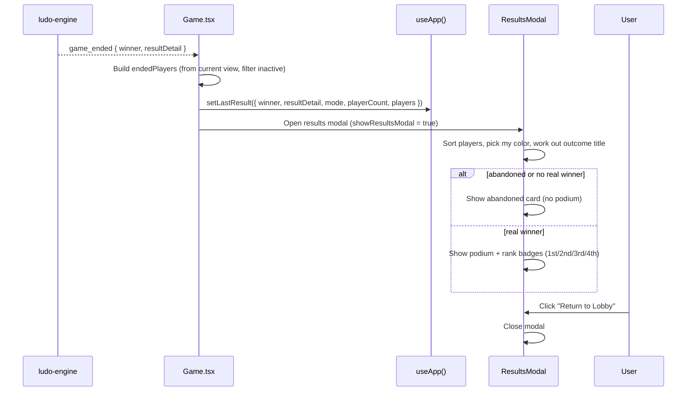

# Frontend — Results

## Table of Contents

- [Overview](#overview) — Post-game results summary shown in-game
- [Files](#files) — Source file inventory
- [Key Types / Interfaces](#key-types--interfaces) — LastResult shape
- [Core Logic / Flow](#core-logic--flow) — Mermaid sequence diagram for results display
- [Logic Paths Summary](#logic-paths-summary) — Decision trees for post-game actions
- [Dependencies](#dependencies) — Internal and external dependencies

---

## Overview

The results screen is shown **inside the Game page** after a match ends, as a
modal overlay (`ResultsModal`). It provides:

1. **Match summary** — winner, final ranks, podium, per-player pieces in goal.
2. **Outcome handling** — victory / defeat / abandoned states with the right label.
3. **Exit** — returns to the lobby/home after the game.

> **Note:** The old standalone `/results` route and `src/pages/Results.tsx` page
> have been **removed** (the file is commented out and the route is no longer
> registered). Results now render via `src/components/ResultsModal.tsx`, opened
> by `Game.tsx` when the engine emits `game_ended`.

---

## Files

| File | Role |
|------|------|
| `src/components/ResultsModal.tsx` | Results overlay — podium, summary, rank badges, outcome title |
| `src/pages/Game.tsx` | Opens the modal on `game_ended`; holds the socket + `lastResult` |
| `src/store.tsx` | `setLastResult` / `lastResult` state |

---

## Key Types / Interfaces

### LastResult (from store)

```typescript
type LastResult = {
  winner: PlayerColor  // Winning color
  resultDetail: string  // How the game ended
  mode: 'pvp' | 'pve' | 'hotseat'  // Game mode
  playerCount: number  // How many players
  players: Array<{  // List of players
    color: PlayerColor  // Seat color
    username: string  // Player's username
    isBot: boolean  // Whether it is a bot
    piecesInGoal: number  // Pieces finished (0-4)
  }>
  abandoned?: boolean   // abandoned/expired match → no podium/rematch
} | null
```

---

## Core Logic / Flow

### Results Rendering

Sequence of steps when the engine reports the game has ended.


---

## Logic Paths Summary

### Results Render Path
```
Game.tsx receives 'game_ended'
  ├── Build endedPlayers: view.players (status !== 'inactive')
  │   └── PvP: trim to activeMatch.playerCount if the list is longer
  ├── setLastResult({ winner, resultDetail, mode, playerCount, players })
  └── setShowResultsModal(true)

ResultsModal renders
  ├── result.abandoned OR no player reached 4 pieces in goal
  │   └── Abandoned card — outcome title "abandoned", no podium
  ├── Else podium by rank + rank badges (1st/2nd/3rd/4th)
  ├── outcome title: victory (my color = winner) / defeat / match complete (hotseat)
  └── Return to Lobby button → onReturnToLobby (closes modal)
```

---

## Dependencies

| Dependency | Purpose |
|-----------|---------|
| `store.tsx` | `useApp` → lastResult, setLastResult |
| `components/UserAvatar.tsx` | Player avatars on the podium |
| `utils/audio.ts` | `retroAudio` end-of-game chimes |
| `utils/ranks.ts` | `getRankTier` for rank display |
