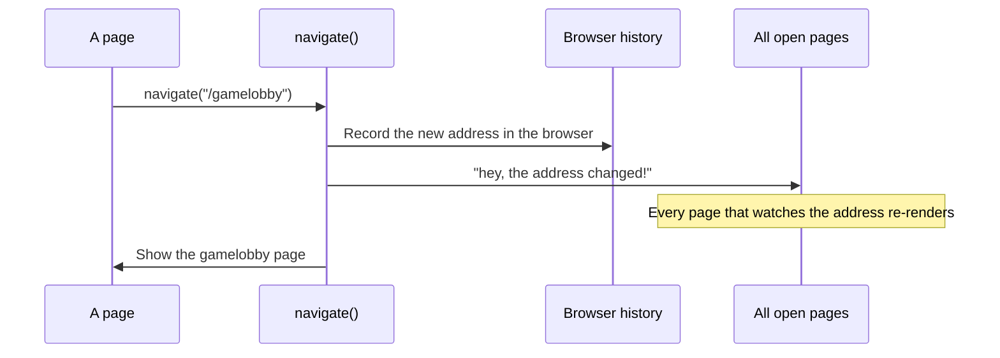
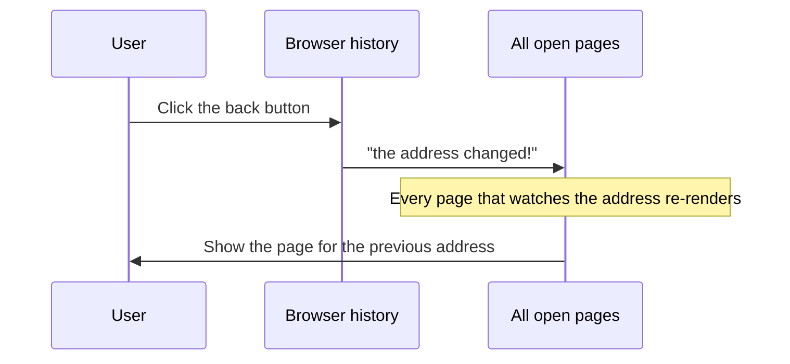

# Frontend — Router

## Table of Contents

- [Overview](#overview) — Custom window.location-based router using useSyncExternalStore
- [Files](#files) — Source file inventory
- [Key Types / Interfaces](#key-types--interfaces) — Route type and navigation function signatures
- [Core Logic / Flow](#core-logic--flow) — Mermaid sequence diagrams for navigation and popstate
- [Logic Paths Summary](#logic-paths-summary) — Decision trees for push/replace navigation
- [Dependencies](#dependencies) — Internal and external dependencies

---

## Overview

The router is a small, custom client-side router built on `window.location` and React's `useSyncExternalStore`. It provides:

1. **Route reading** — `useRoute()` returns the current `{ path, query }` and updates the page when the URL changes.
2. **Navigation** — `navigate(to, { replace })` changes the URL, resets scroll to top, and tells every subscriber to re-render.
3. **No React Router** — deliberately minimal, to avoid the extra dependency.

---

## Files

| File | Role |
|------|------|
| `src/router.tsx` | Router implementation — `useRoute`, `navigate`, `Route` type |

---

## Key Types / Interfaces

### Route

```typescript
export type Route = {
  path: string;                // Normalized pathname (no trailing slashes, '/' for root)
  query: URLSearchParams;      // Parsed query string
}
```

### navigate

```typescript
export function navigate(to: string, opts?: { replace?: boolean }): void
```

| Parameter | Type | Description |
|-----------|------|-------------|
| `to` | `string` | Target pathname (e.g. `/gamelobby`) |
| `opts.replace` | `boolean` | If true, uses `replaceState` instead of `pushState` |

---

## Core Logic / Flow

### 1. Navigation

Sequence of steps when `navigate('/gamelobby')` is called.


### 2. Popstate (Back/Forward)

Sequence of steps when the user clicks the browser back/forward button.


---

## Logic Paths Summary

### navigate Path
```
navigate(to, { replace? })
  ├── replace = true → history.replaceState(null, '', to)
  └── replace = false → history.pushState(null, '', to)
  ├── window.scrollTo(0, 0)
  └── emit() → notify all subscribers
```

### useRoute Hook Path
```
useRoute()
  └── useSyncExternalStore(
       subscribe: (cb) => { listeners.add(cb); return () => listeners.delete(cb) }
       getSnapshot: () => snapshot
     )
  └── Returns { path, query }
```

---

## Dependencies

| Dependency | Purpose |
|-----------|---------|
| `react` | `useSyncExternalStore` for reactive subscription to route changes |
| (none) | No external routing library; pure browser History API |