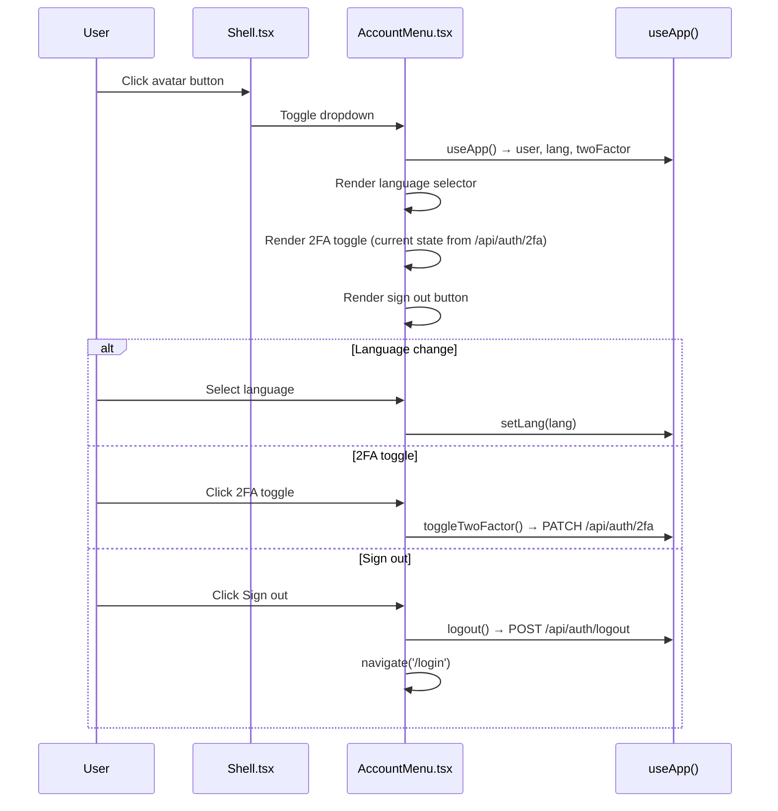

# Frontend — Settings

## Table of Contents

- [Overview](#overview) — Account settings and game preferences
- [Files](#files) — Source file inventory
- [Key Types / Interfaces](#key-types--interfaces) — Setting keys and defaults
- [Core Logic / Flow](#core-logic--flow) — AccountMenu settings flow
- [Logic Paths Summary](#logic-paths-summary) — Decision trees for toggle behavior
- [Dependencies](#dependencies) — Internal and external dependencies

---

## Overview

User settings are managed through the `AccountMenu` component (rendered by `Shell`, which is currently unused by routes — no `/settings` page exists). The AccountMenu provides:

1. **Language selector** — toggle between supported languages.
2. **2FA toggle** — enable/disable two-factor authentication (calls `PATCH /api/auth/2fa`).
3. **Sign out** — calls `POST /api/auth/logout` and navigates to `/login`.

Game preference toggles (sound, music, auto-roll, etc.) remain in `store.tsx` as `SETTING_DEFAULTS` and are not exposed through a dedicated settings page yet.

---

## Files

| File | Role |
|------|------|
| `src/components/AccountMenu.tsx` | Account menu dropdown (language, 2FA, sign out) |

> **Note:** There is no `src/pages/Settings.tsx` — settings live in the `AccountMenu` and in `store.tsx` (game preference toggles).

---

## Key Types / Interfaces

### SETTING_DEFAULTS

```typescript
export const SETTING_DEFAULTS: Record<string, boolean> = {
  '0-0': true,   // Sound effects
  '0-1': true,   // Music
  '1-0': true,   // Auto-roll
  '1-1': false,  // Fast animations
  '1-2': true,   // Move hints
  '2-0': true,   // Friend invites
  '2-1': false,  // Weekly recap
}
```

### Setting State

```typescript
settings: Record<string, boolean>  // Override values; falls back to SETTING_DEFAULTS
```

---

## Core Logic / Flow

### AccountMenu Settings (current)

Sequence of steps when the AccountMenu is used.


---

## Logic Paths Summary

### AccountMenu Path
```
<AccountMenu />
  ├── Render avatar button with initials
  ├── onClick → toggle dropdown
  ├── Language option → setLang(lang)
  ├── 2FA option → toggleTwoFactor() → PATCH /api/auth/2fa
  └── Sign out → logout() → POST /api/auth/logout → navigate('/login')
```

### Game Settings Path (in store.tsx)
```
settingOn(key)
  └── Return settings[key] ?? SETTING_DEFAULTS[key] ?? false

toggleSetting(key)
  └── Flip current value (settings or default)
```

---

## Dependencies

| Dependency | Purpose |
|-----------|---------|
| `store.tsx` | `useApp` for `settings`, `settingOn`, `toggleSetting`, `lang`, `setLang`, `toggleTwoFactor`, `logout` |
| `theme.ts` | Inline styles for toggle switches |