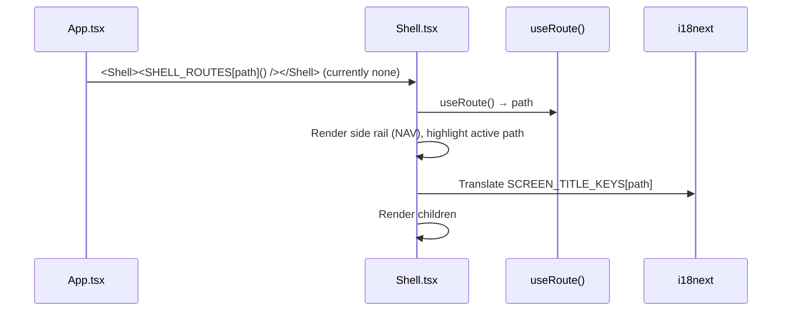

# Frontend — Shell (Layout)

## Table of Contents

- [Overview](#overview) — Layout wrapper and navigation rail
- [Files](#files) — Source file inventory
- [Key Types / Interfaces](#key-types--interfaces) — NAV items, SCREEN_TITLE_KEYS
- [Core Logic / Flow](#core-logic--flow) — Mermaid sequence diagram of shell rendering
- [Logic Paths Summary](#logic-paths-summary) — Decision trees for navigation
- [Dependencies](#dependencies) — Internal and external dependencies

---

## Overview

The `Shell` component is the authenticated layout wrapper — a side rail plus header. In the current `App.tsx`, `SHELL_ROUTES` is empty (all pages render full-bleed), so `Shell` is defined and importable but **not currently wrapping any route**. Pages use `RetroNavbar` (top bar) directly instead.

The Shell provides:

1. **Sidebar rail** — vertical nav with glyph icons for Home, Friends, Profile, Leaderboard.
2. **Header** — screen title (i18n key) + child content.
3. **Nav highlighting** — active route derived from `useRoute().path`.

---

## Files

| File | Role |
|------|------|
| `src/components/Shell.tsx` | Shell layout — side rail, header, nav (unused by current routes) |
| `src/components/RetroNavbar.tsx` | Top navigation bar used by the full-bleed pages instead |

---

## Key Types / Interfaces

### NAV

```typescript
const NAV: Array<{ path: string; glyph: string; titleKey: string }> = [
  { path: '/home', glyph: '⌂', titleKey: 'nav.home' },
  { path: '/friends', glyph: '♟', titleKey: 'nav.friends' },
  { path: '/profile', glyph: '👤', titleKey: 'nav.profile' },
  { path: '/leaderboard', glyph: '♛', titleKey: 'nav.leaderboard' },
]
```

### SCREEN_TITLE_KEYS

```typescript
export const SCREEN_TITLE_KEYS: Record<string, string> = {
  '/home': 'nav.home',
  '/friends': 'nav.friends',
  '/profile': 'nav.profile',
  '/leaderboard': 'nav.leaderboard',
  // ...
}
```

---

## Core Logic / Flow

### Shell Rendering

Sequence of steps when a route renders inside the Shell.


---

## Logic Paths Summary

### Shell Render Path
```
<Shell children>
  ├── useRoute() → path
  ├── Render NAV rail, highlight active
  ├── Render header title from SCREEN_TITLE_KEYS[path]
  └── Render children
```

---

## Dependencies

| Dependency | Purpose |
|-----------|---------|
| `router.tsx` | `useRoute`, `navigate` |
| `store.tsx` | `useApp` (user, logout) |
| `i18n.ts` | `useTranslation` for nav titles |
