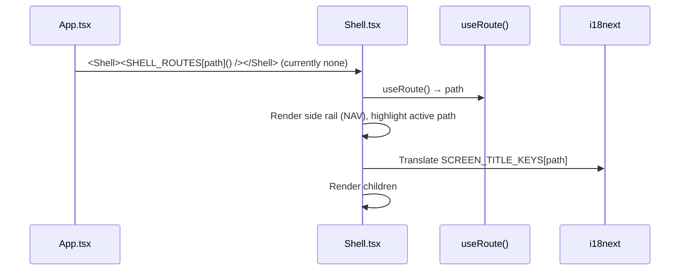

# Frontend — Shell (Layout)

## Table of Contents

- [Overview](#overview) — Layout container and navigation rail
- [Files](#files) — Source file inventory
- [Key Types / Interfaces](#key-types--interfaces) — NAV items, SCREEN_TITLE_KEYS
- [Core Logic / Flow](#core-logic--flow) — Mermaid sequence diagram of shell rendering
- [Logic Paths Summary](#logic-paths-summary) — Decision trees for navigation
- [Dependencies](#dependencies) — Internal and external dependencies

---

## Overview

`Shell` is the layout container for signed-in pages: a side rail plus a header. In the current `App.tsx`, `SHELL_ROUTES` is empty (every page renders full-bleed, with no side rail), so `Shell` is defined and can be imported, but **no route uses it**. Pages render `RetroNavbar` (the top bar) directly instead.

The Shell provides:

1. **Sidebar rail** — vertical navigation with glyph icons for Home, Friends, Profile and Leaderboard.
2. **Header** — the screen title (an i18n (internationalization) key) and the page content.
3. **Nav highlighting** — the active route comes from `useRoute().path`.

---

## Files

| File | Role |
|------|------|
| `src/components/Shell.tsx` | Shell layout — side rail, header, nav (unused by current routes) |
| `src/components/RetroNavbar.tsx` | Top navigation bar used by the full-bleed pages instead |

---

## Key Types / Interfaces

### NAV

```typescript
const NAV: Array<{ path: string; glyph: string; titleKey: string }> = [
  { path: '/home', glyph: '⌂', titleKey: 'nav.home' },
  { path: '/friends', glyph: '♟', titleKey: 'nav.friends' },
  { path: '/profile', glyph: '👤', titleKey: 'nav.profile' },
  { path: '/leaderboard', glyph: '♛', titleKey: 'nav.leaderboard' },
]
```

### SCREEN_TITLE_KEYS

```typescript
export const SCREEN_TITLE_KEYS: Record<string, string> = {
  '/home': 'nav.home',
  '/leaderboard': 'nav.leaderboard',
  '/friends': 'nav.friends',
  '/profile': 'nav.playerProfile',
}
```

---

## Core Logic / Flow

### Shell Rendering

Sequence of steps when a route renders inside the Shell.


---

## Logic Paths Summary

### Shell Render Path
```
<Shell children>
  ├── useRoute() → path
  ├── Render NAV rail, highlight active
  ├── Render header title from SCREEN_TITLE_KEYS[path]
  └── Render children
```

---

## RetroNavbar Notes

- **Compact mode.** Below the `xl` breakpoint (1280px) the sidebar collapses to an icon-only rail. The labels are switched on and off from JavaScript instead of being hidden by CSS, because several width and padding values on the bar are plain inline styles. Every page that renders the navbar uses the same threshold on its own `<aside>` container (`w-[88px] xl:w-[270px]`), so the two widths match.
- **The account popover renders into `document.body`** (a portal), so no ancestor stacking context can clip or cover it. Its position comes from the trigger button's current bounding box, because the portal is no longer inside the `position: relative` element that used to anchor it in CSS.
- **Nav track layout.** `overflow-y: auto` on the track exists only as a fallback: the intended layout is that the five items fit without scrolling. An earlier version also shifted the track vertically so the active item sat nearer the centre (up to +/-95px, via `(idx - 2.5) * 38`). At short window heights that shift was larger than the space available, which pushed the last item down over the theme button, so the shift was removed. Items are still dimmed and scaled by distance from the active item; they are just no longer repositioned.

---

## Dependencies

| Dependency | Purpose |
|-----------|---------|
| `router.tsx` | `useRoute`, `navigate` |
| `store.tsx` | `useApp` (user, logout) |
| `i18n.ts` | `useTranslation` for nav titles |
