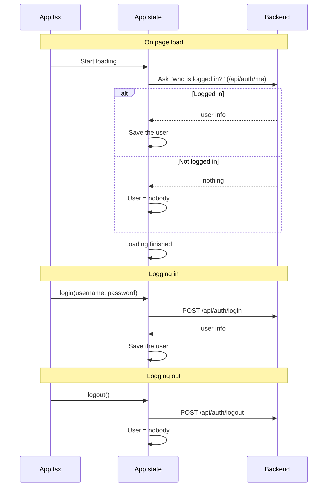
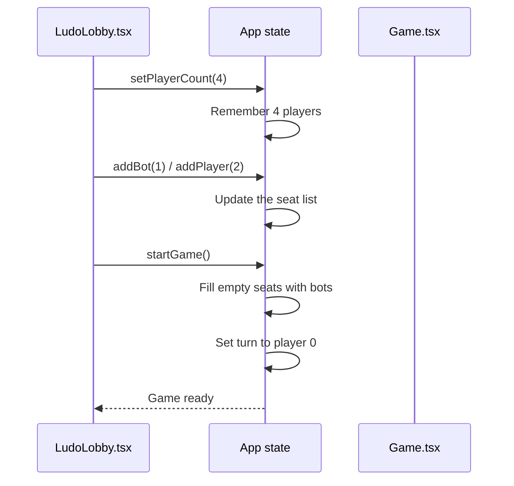

# Frontend — Store (Global State)

## Table of Contents

- [Overview](#overview) — React Context global state: auth, game setup, settings
- [Files](#files) — Source file inventory
- [Key Types / Interfaces](#key-types--interfaces) — AuthUser, Seat, Mode, Difficulty, AppState
- [Core Logic / Flow](#core-logic--flow) — Mermaid sequence diagrams for auth lifecycle and game setup
- [Logic Paths Summary](#logic-paths-summary) — Decision trees for auth and game state mutations
- [Dependencies](#dependencies) — Internal and external dependencies

---

## Overview

The store is a single React Context provider (`AppProvider`) that holds all global UI state. It provides:

1. **Auth session** — `user` object, `authReady` flag, `login`, `register`, `logout` actions.
2. **Game setup state** — `playerCount` (1-4), `seats` array (you/bot/player/empty), `dice`, `rolling`, `turn`.
3. **Settings** — on/off switches (sound, music, auto-roll, …) each identified by a string key, with defaults.
4. **Real-time match** — `activeMatch` (engine credentials from `POST /api/match/create`) and `lastResult` (finished-match snapshot for the Results page).
5. **Helpers** — `addBot`, `removeBot`, `addPlayer`, `removePlayer`, `startGame`, `roll`, `endTurn`, `settingOn`, `toggleSetting`.

---

## Files

| File | Role |
|------|------|
| `src/store.tsx` | `AppProvider`, `useApp` hook, all state and actions |

---

## Key Types / Interfaces

### AuthUser

```typescript
export type AuthUser = {
  id: string  // Unique ID
  username: string  // Player's username
  displayName?: string  // Name shown in the game
  email?: string | null  // Email address
  twoFactorEnabled?: boolean  // Whether 2FA is on
}
```

### Seat

```typescript
export type Seat =
  | { type: 'you' }
  | { type: 'bot'; name: string }
  | { type: 'player'; name: string }
  | { type: 'empty' }
```

### PlayerCount

```typescript
export type PlayerCount = 1 | 2 | 3 | 4
```

### Lang

```typescript
export type Lang = 'en' | 'ms' | 'fr'
```

### ActiveMatch / LastResult

```typescript
export type ActiveMatch = {
  gameId: string  // ID of the game
  token: string        // JWT for the Socket.IO handshake
  color: PlayerColor  // Seat color
  inviteCode?: string  // Code to join a private game
  mode: 'pvp' | 'pve' | 'hotseat'  // Game mode
  playerCount: number  // How many players
} | null

export type LastResult = {
  winner: PlayerColor  // Winning color
  resultDetail: string  // How the game ended
  mode: 'pvp' | 'pve' | 'hotseat'  // Game mode
  playerCount: number  // How many players
  players: Array<{ color: PlayerColor; username: string; isBot: boolean; piecesInGoal: number }>  // List of players
  abandoned?: boolean  // Whether the game was abandoned
} | null
```

### AppState (partial)

```typescript
type AppState = {
  user: AuthUser | null  // The logged-in user
  authReady: boolean  // Whether login state is loaded
  // Auth actions
  login: (identifier: string, password: string) => Promise<{ error?: string; pendingToken?: string }>  // Logs the user in
  register: (username: string, password: string, email: string) => Promise<string | null>  // Creates a new account
  verify2fa: (pendingToken: string, code: string) => Promise<string | null>  // Checks the 2FA code
  forgotPassword: (email: string) => Promise<string | null>  // Requests a password reset
  resetPassword: (token: string, password: string) => Promise<string | null>  // Sets a new password
  logout: () => Promise<void>  // Logs the user out
  // 2FA preference
  twoFactor: boolean  // Whether 2FA is on
  toggleTwoFactor: () => void  // Turns 2FA on/off
  // Game setup state
  playerCount: PlayerCount  // How many players
  seats: Seat[]  // List of seats (you/bot/player/empty)
  dice: number  // Current dice value
  rolling: boolean  // Whether the dice is animating
  turn: number  // Whose turn (index)
  settings: Record<string, boolean>  // Game settings (sound, music, etc.)
  setPlayerCount: (n: PlayerCount) => void  // Changes the player count
  addBot: (i: number) => void  // Adds a bot to a seat
  removeBot: (i: number) => void  // Removes a bot from a seat
  addPlayer: (i: number) => void  // Adds a human player to a seat
  removePlayer: (i: number) => void  // Removes a player from a seat
  renamePlayer: (i: number, name: string) => void  // Renames a seat
  resetSeats: () => void  // Clears all seats except the host
  startGame: () => boolean  // Starts the game
  roll: () => void  // Rolls the dice
  endTurn: () => void  // Passes the turn
  settingOn: (key: string) => boolean  // Checks if a setting is on
  toggleSetting: (key: string) => void  // Flips a setting
  // Theme
  theme: ThemeType  // Current theme (synthwave / win95 / terminal)
  setTheme: (t: ThemeType) => void  // Changes the theme
  // Real-time match
  activeMatch: ActiveMatch  // The current match info
  setActiveMatch: (m: ActiveMatch) => void  // Updates the current match
  lastResult: LastResult  // Finished match results
  setLastResult: (r: LastResult) => void  // Saves finished match results
  // Language
  lang: Lang  // Selected language
  setLang: (l: Lang) => void  // Changes the language
  // Presence
  setPlaying: (playing: boolean) => void  // Marks the user as in-game
}
```

### SETTING_DEFAULTS

```typescript
export const SETTING_DEFAULTS: Record<string, boolean> = {
  '0-0': true,  // Sound effects
  '0-1': true,  // Music
  '1-0': true,  // Auto-roll
  '1-1': false, // Fast animations
  '1-2': true,  // Move hints
  '2-0': true,  // Friend invites
  '2-1': false, // Weekly recap
}
```

---

## Core Logic / Flow

### 1. Auth Lifecycle

Sequence of steps from page load to authenticated session.


### 2. Game Setup Flow

Sequence of steps from selecting player count to starting a game.


> **Note:** `startGame` only assembles local seat state for the offline/hotseat preview. For real matches, the lobby calls `POST /api/match/create` (or the PvP/PvE shortcuts) and stores the returned `activeMatch` — the Game page then connects to the engine over Socket.IO.

---

## Logic Paths Summary

### Auth Lifecycle Path
```
Mount
  └── fetch('/api/auth/me')
       ├── 200 → setUser(user), setAuthReady(true)
       └── error → setUser(null), setAuthReady(true)

login(username, password)
  └── POST /api/auth/login
       ├── 200 → setUser(user), return null
       └── error → return error message

register(username, password, email?)
  └── POST /api/auth/register
       ├── 200 → setUser(user), return null
       └── error → return error message

logout()
  └── POST /api/auth/logout → setUser(null)
```

### Game Setup Path
```
setPlayerCount(n)
  └── Update playerCount state

addBot(i)
  └── Find unused bot name from BOT_POOL → replace seat[i] with { type: 'bot', name }

addPlayer(i) / removePlayer(i)
  └── Replace seat[i] with { type: 'player', name } / { type: 'empty' }

startGame()
  ├── Count bots in seats[0..playerCount)
  ├── If bots < 1 → return false
  ├── Fill remaining empty seats with bots from BOT_POOL
  ├── setTurn(0)
  └── return true

roll()
  └── If not already rolling → setRolling(true) → setTimeout(650ms) → setDice(1-6), setRolling(false)

endTurn()
  └── setTurn((t + 1) % playerCount)
```

### Settings Path
```
settingOn(key)
  └── Return settings[key] ?? SETTING_DEFAULTS[key] ?? false

toggleSetting(key)
  └── Flip current value (settings or default)
```

---

## Dependencies

| Dependency | Purpose |
|-----------|---------|
| `theme.ts` | `BOT_POOL`, `SEAT_COLORS`, theme constants + CSS-variable helpers |
| `router.tsx` | `navigate` for `/game` redirect after start |
| `validatePassword.ts` | Client-side password validation |
| `API` | `/api/auth/me`, `/api/auth/login`, `/api/auth/register`, `/api/auth/logout`, `/api/auth/2fa/verify`, `/api/auth/forgot-password`, `/api/auth/reset-password`, `/api/auth/2fa`, `/api/presence/heartbeat` |
