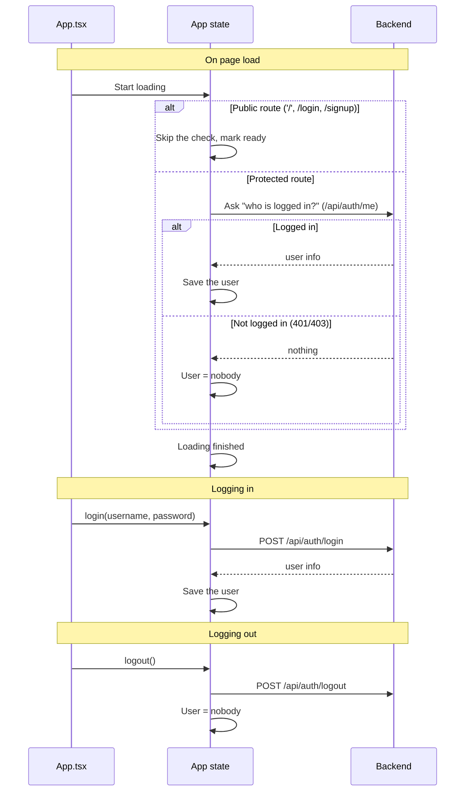
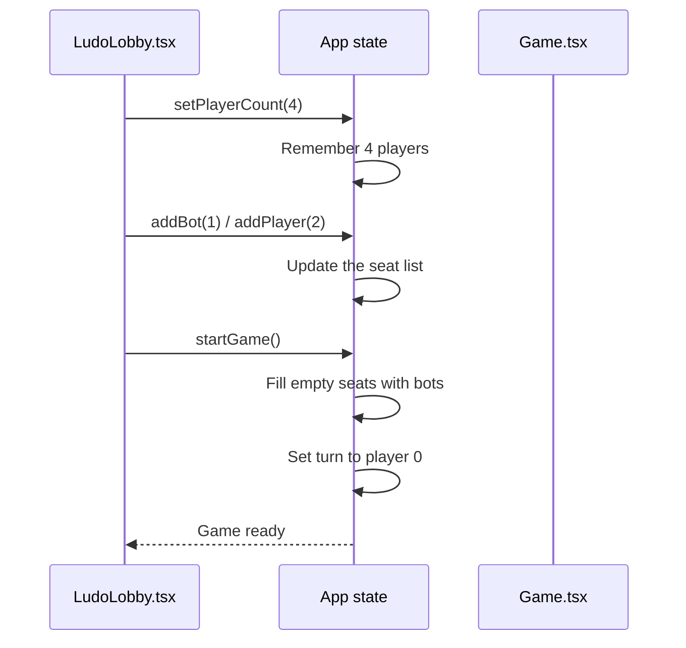

# Frontend — Store (Global State)

## Table of Contents

- [Overview](#overview) — React Context global state: authentication, game setup, settings
- [Files](#files) — Source file inventory
- [Key Types / Interfaces](#key-types--interfaces) — AuthUser, Seat, PlayerCount, Lang, ActiveMatch, LastResult, AppState
- [Core Logic / Flow](#core-logic--flow) — Mermaid sequence diagrams for the authentication lifecycle and game setup
- [Logic Paths Summary](#logic-paths-summary) — Decision trees for authentication and game state changes
- [Dependencies](#dependencies) — Internal and external dependencies

---

## Overview

The store is one React Context provider (`AppProvider`) that holds all global UI (user interface) state. It has:

1. **Authentication session** — the `user` object, the `authReady` flag, and the `login`, `register` and `logout` actions.
2. **Game setup state** — `playerCount` (2-4), the `seats` array (you/bot/player/empty), `dice`, `rolling` and `turn`.
3. **Settings** — on/off switches (sound, music, auto-roll and others), each with a string key and a default value.
4. **Real-time match** — `activeMatch` (the engine credentials from `POST /api/match/create`) and `lastResult` (the finished-match data for the Results view).
5. **Helpers** — `addBot`, `removeBot`, `addPlayer`, `removePlayer`, `startGame`, `roll`, `endTurn`, `settingOn`, `toggleSetting`.
6. **Session keep-alive** — a presence heartbeat every 20 seconds (`PRESENCE_HEARTBEAT_MS` / `sendPresenceHeartbeat()`) while signed in, plus a `/api/auth/refresh` call every 14 minutes, so the 15-minute access token never expires while a request is in flight. This is the **client → server** direction only, proving the browser is still here; keeping the notification SSE stream alive runs the other way and lives server-side (`SSE_HEARTBEAT_MS`). See [`../architecture.md`](../architecture.md) → Connection liveness (two-direction heartbeats).

---

## Files

| File | Role |
|------|------|
| `src/store.tsx` | `AppProvider`, `useApp` hook, all state and actions |

---

## Key Types / Interfaces

### AuthUser

```typescript
export type AuthUser = {
  id: string  // Unique ID
  username: string  // Player's username
  displayName?: string  // Name shown in the game
  email?: string | null  // Email address
  twoFactorEnabled?: boolean  // Whether 2FA is on
  avatarStyle?: string | null  // DiceBear style for the fallback avatar
  hasAvatarPhoto?: boolean  // Whether a custom uploaded photo exists
}
```

### Seat

```typescript
export type Seat =
  | { type: 'you' }
  | { type: 'bot'; name: string }
  | { type: 'player'; name: string }
  | { type: 'empty' }
```

### PlayerCount

```typescript
export type PlayerCount = 2 | 3 | 4
```

### Lang

```typescript
export type Lang = 'en' | 'ms' | 'fr'
```

### ActiveMatch / LastResult

```typescript
export type ActiveMatch = {
  gameId: string  // ID of the game
  token: string        // JWT (JSON Web Token) for the Socket.IO handshake
  color: PlayerColor  // Seat color
  inviteCode?: string  // Code to join a private game
  mode: 'pvp' | 'pve' | 'hotseat'  // Game mode
  playerCount: number  // How many players
} | null

export type LastResult = {
  winner: PlayerColor  // Winning color
  resultDetail: string  // How the game ended
  mode: 'pvp' | 'pve' | 'hotseat'  // Game mode
  playerCount: number  // How many players
  players: Array<{ color: PlayerColor; username: string; isBot: boolean; piecesInGoal: number }>  // List of players
  abandoned?: boolean  // Whether the game was abandoned
} | null
```

### AppState (partial)

```typescript
type AppState = {
  user: AuthUser | null  // The logged-in user
  authReady: boolean  // Whether the sign-in state has loaded
  // Auth actions
  login: (identifier: string, password: string) => Promise<{ error?: string; pendingToken?: string }>  // Logs the user in
  register: (username: string, password: string, email: string) => Promise<string | null>  // Creates a new account
  verify2fa: (pendingToken: string, code: string) => Promise<string | null>  // Checks the 2FA code
  forgotPassword: (email: string) => Promise<string | null>  // Requests a password reset
  resetPassword: (token: string, password: string) => Promise<string | null>  // Sets a new password
  logout: () => Promise<void>  // Logs the user out
  // 2FA preference
  twoFactor: boolean  // Whether 2FA is on
  toggleTwoFactor: () => void  // Turns 2FA on/off
  // Game setup state
  playerCount: PlayerCount  // How many players
  seats: Seat[]  // List of seats (you/bot/player/empty)
  dice: number  // Current dice value
  rolling: boolean  // Whether the dice is animating
  turn: number  // Whose turn (index)
  settings: Record<string, boolean>  // Game settings (sound, music and others)
  setPlayerCount: (n: PlayerCount) => void  // Changes the player count
  addBot: (i: number) => void  // Adds a bot to a seat
  removeBot: (i: number) => void  // Removes a bot from a seat
  addPlayer: (i: number) => void  // Adds a human player to a seat
  removePlayer: (i: number) => void  // Removes a player from a seat
  renamePlayer: (i: number, name: string) => void  // Renames a seat
  resetSeats: () => void  // Clears all seats except the host
  startGame: () => boolean  // Starts the game
  roll: () => void  // Rolls the dice
  endTurn: () => void  // Passes the turn
  settingOn: (key: string) => boolean  // Checks if a setting is on
  toggleSetting: (key: string) => void  // Flips a setting
  // Theme
  theme: ThemeType  // Current theme (synthwave / win95 / terminal)
  setTheme: (t: ThemeType) => void  // Changes the theme
  // Real-time match
  activeMatch: ActiveMatch  // The current match info
  setActiveMatch: (m: ActiveMatch) => void  // Updates the current match
  lastResult: LastResult  // Finished match results
  setLastResult: (r: LastResult) => void  // Saves finished match results
  // Language
  lang: Lang  // Selected language
  setLang: (l: Lang) => void  // Changes the language
  // Presence
  setPlaying: (playing: boolean) => void  // Marks the user as in-game
}
```

### SETTING_DEFAULTS

```typescript
export const SETTING_DEFAULTS: Record<string, boolean> = {
  '0-0': true,  // Sound effects
  '0-1': true,  // Music
  '1-0': true,  // Auto-roll
  '1-1': false, // Fast animations
  '1-2': true,  // Move hints
  '2-0': true,  // Friend invites
  '2-1': false, // Weekly recap
}
```

---

## Core Logic / Flow

### 1. Auth Lifecycle

Sequence of steps from page load to a signed-in session.


### 2. Game Setup Flow

Sequence of steps from selecting player count to starting a game.


> **Note:** `startGame` only builds the local seat state used by the offline/hotseat preview. For a real match, the lobby calls `POST /api/match/create` (or the PvP (player versus player) and PvE (player versus environment) shortcuts) and stores the returned `activeMatch`; the Game page then connects to the engine over Socket.IO.

---

## Logic Paths Summary

### Authentication Lifecycle Path
```
Mount
  └── path is '/', '/login', or '/signup' → skip the check, setAuthReady(true)
  └── otherwise fetch('/api/auth/me')
       ├── 200 → setUser(user), setAuthReady(true)
       ├── 401/403 → setUser(null) (genuinely signed out), setAuthReady(true)
       └── 429/5xx/network → retry up to 3× (exponential backoff, honours Retry-After),
            then leave `user` unchanged and setAuthReady(true)

login(username, password)
  └── POST /api/auth/login
       ├── 200 → setUser(user), return null
       └── error → return error message

register(username, password, email?)
  └── POST /api/auth/register
       ├── 200 → setUser(user), return null
       └── error → return error message

logout()
  └── POST /api/auth/logout → setUser(null)
```

### Game Setup Path
```
setPlayerCount(n)
  └── Update playerCount state

addBot(i)
  └── Find unused bot name from BOT_POOL → replace seat[i] with { type: 'bot', name }

addPlayer(i) / removePlayer(i)
  └── Replace seat[i] with { type: 'player', name } / { type: 'empty' }

startGame()
  ├── Count bots in seats[0..playerCount)
  ├── If bots < 1 → return false
  ├── Fill remaining empty seats with bots from BOT_POOL
  ├── setTurn(0)
  └── return true

roll()
  └── If not already rolling → setRolling(true) → setTimeout(650ms) → setDice(1-6), setRolling(false)

endTurn()
  └── setTurn((t + 1) % playerCount)
```

### Settings Path
```
settingOn(key)
  └── Return settings[key] ?? SETTING_DEFAULTS[key] ?? false

toggleSetting(key)
  └── Flip current value (settings or default)
```

---

## `api.ts` — Refresh and Retry

`apiFetch(url, init)` handles every authenticated call:

- On a **401** it refreshes once through `POST /api/auth/refresh`, then retries the original request. All callers share one in-flight refresh request, so two 401s arriving at the same time can never rotate the refresh token twice.
- If the refresh **fails**, the two cases are kept apart: a missing or expired refresh token means the user is really signed out, while a *blocked* refresh (for example, rate-limited) returns its own status instead of pretending the user signed out.
- It adds the `ngrok-skip-browser-warning` header so the ngrok interstitial page never intercepts an API (Application Programming Interface) call (other hosts ignore the header), and it builds headers with the `Headers` constructor, so headers passed by the caller are merged instead of overwritten.

`store.tsx` also refreshes **early**, every 14 minutes: access tokens expire after 15 minutes (`JwtModule` `expiresIn: '15m'`), so refreshing one minute ahead keeps the presence heartbeat (and any other call) from arriving with an expired token. The 401 retry path above would still recover, but the browser logs the 401 first.

---

## Dependencies

| Dependency | Purpose |
|-----------|---------|
| `theme.ts` | `BOT_POOL` for bot seat names |
| `i18n.ts` | `i18n.changeLanguage` and `i18n.t` for default player names |
| `api.ts` | `apiFetch` (refresh-and-retry) and `refreshOnce` for the proactive 14-minute token refresh |
| `game/types.ts` | `PlayerColor` for `ActiveMatch` |
| API (Application Programming Interface) | `/api/auth/me`, `/api/auth/login`, `/api/auth/register`, `/api/auth/logout`, `/api/auth/2fa/verify`, `/api/auth/forgot-password`, `/api/auth/reset-password`, `/api/auth/2fa`, `/api/presence/heartbeat` |
