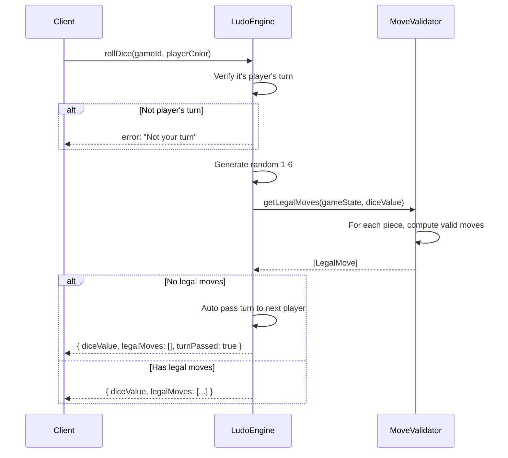
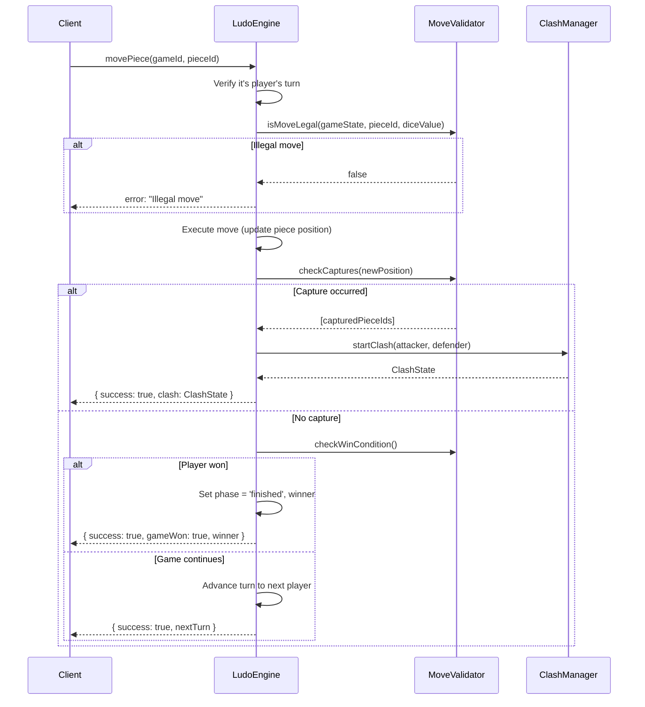
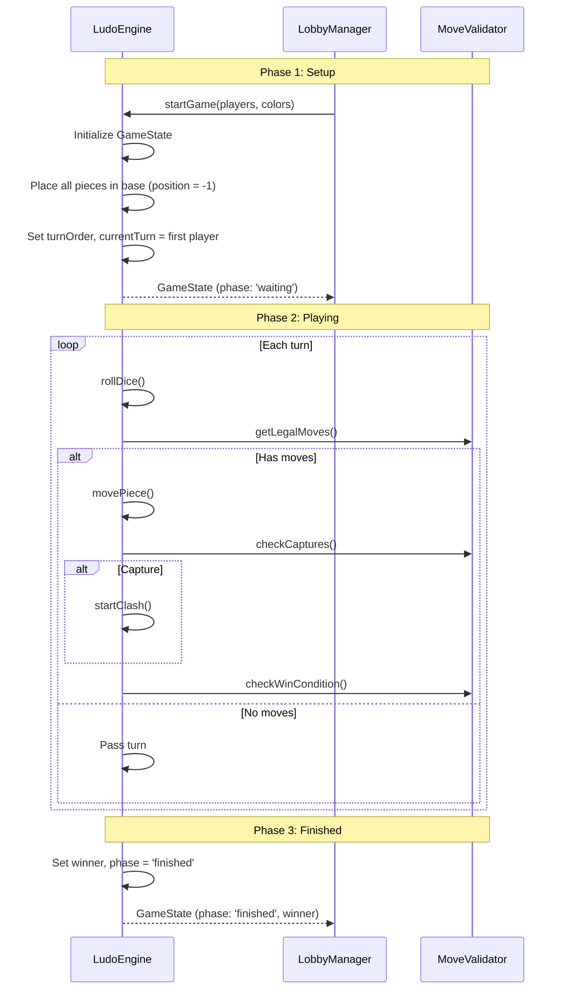

# Ludo Engine — Core

## Table of Contents

- [Overview](#overview) — Core game logic, types, and validation
- [Files](#files) — Every source file in the module and its role
- [Key Types / Interfaces](#key-types--interfaces) — Game state, pieces, moves, and events
- [Core Logic / Flow](#core-logic--flow) — Mermaid sequence diagrams for dice roll, piece movement, and game lifecycle
- [Logic Paths Summary](#logic-paths-summary) — Decision trees for each operation
- [Dependencies](#dependencies) — Internal and external dependencies

---

## Overview

The Ludo Engine Core is the heart of the game logic. It provides:

1. **Game state management** — tracks board positions, player turns, and game phase.
2. **Dice rolling** — random 1-6 roll with turn management.
3. **Piece movement** — validates and executes moves on the board.
4. **Move validation** — computes legal moves, captures, and win conditions.
5. **Board mapping** — translates step numbers to board positions and detects safe zones.

---

## Files

| File | Role |
|------|------|
| `types.ts` | All type definitions: PlayerColor, GameState, Piece, LegalMove, MoveResult, GameEvent, etc. |
| `engine.ts` | Core LudoEngine class with rollDice(), movePiece(), and player lifecycle handlers |
| `move-validator.ts` | MoveValidator for legal move computation, capture resolution, and win checking |
| `board-mapper.ts` | BoardMapper for step-to-track-position translation and safe zone detection |
| `player-handler.ts` | Player lifecycle: disconnect with grace period, reconnect, ready, exit/forfeit |

---

## Key Types / Interfaces

### PlayerColor

```typescript
enum PlayerColor {
  red = 'red',
  blue = 'blue',
  green = 'green',
  yellow = 'yellow',
}
```

### Piece

```typescript
interface Piece {
  id: string;           // Unique piece identifier (e.g. "red-0", "red-1")
  color: PlayerColor;
  position: number;     // -1 = in base, 0-55 = on track, 56+ = in goal
  isInGoal: boolean;
  isInBase: boolean;
}
```

### GameState

```typescript
interface GameState {
  gameId: string;
  players: PlayerMeta[];
  pieces: Piece[];
  currentTurn: PlayerColor;
  diceValue: number | null;
  phase: 'waiting' | 'rolling' | 'moving' | 'clash' | 'finished';
  winner: PlayerColor | null;
  turnOrder: PlayerColor[];
  moveHistory: MoveRecord[];
  startedAt: number;
  lastMoveAt: number;
}
```

### LegalMove

```typescript
interface LegalMove {
  pieceId: string;
  from: number;
  to: number;
  captures: string[];   // IDs of captured opponent pieces
  entersGoal: boolean;
  entersHomeStretch: boolean;
  leavesBase: boolean;
}
```

### MoveResult

```typescript
interface MoveResult {
  success: boolean;
  gameState: GameState;
  events: GameEvent[];
  clash?: ClashState;   // If a capture triggers a clash
}
```

### GameEvent

```typescript
type GameEvent =
  | { type: 'dice_rolled'; player: PlayerColor; value: number }
  | { type: 'piece_moved'; pieceId: string; from: number; to: number }
  | { type: 'piece_captured'; pieceId: string; capturedBy: string }
  | { type: 'piece_entered_goal'; pieceId: string }
  | { type: 'piece_left_base'; pieceId: string }
  | { type: 'clash_started'; attacker: string; defender: string }
  | { type: 'clash_resolved'; winner: string; loser: string }
  | { type: 'game_won'; winner: PlayerColor }
  | { type: 'player_disconnected'; player: PlayerColor }
  | { type: 'player_reconnected'; player: PlayerColor };
```

---

## Core Logic / Flow

### 1. Dice Roll

Sequence of steps when a player rolls the dice on their turn.


### 2. Piece Movement

Sequence of steps when a player moves a piece to a target position.


### 3. Game Lifecycle

Sequence of steps showing the full lifecycle of a game from start to finish.


---

## Logic Paths Summary

### Dice Roll Path
```
rollDice(gameId, playerColor)
  ├── Verify turn ownership → error if not player's turn
  ├── Generate random 1-6
  ├── Compute legal moves for all pieces
  │   ├── No legal moves → auto pass turn, return { diceValue, turnPassed: true }
  │   └── Has legal moves → return { diceValue, legalMoves: [...] }
```

### Move Piece Path
```
movePiece(gameId, pieceId)
  ├── Verify turn ownership → error if not player's turn
  ├── Validate move legality → error if illegal
  ├── Execute move (update piece position)
  ├── Check for captures
  │   ├── Capture detected → start clash minigame
  │   └── No capture → continue
  ├── Check win condition
  │   ├── All pieces in goal → game won
  │   └── Not won → advance turn
  └── Return MoveResult
```

### Move Validation Path
```
getLegalMoves(gameState, diceValue)
  For each piece of current player:
    ├── Piece in base:
    │   ├── diceValue = 6 → can leave base (position = start)
    │   └── diceValue ≠ 6 → no move
    ├── Piece on track:
    │   ├── Calculate new position = current + diceValue
    │   ├── Check if new position is within board bounds
    │   ├── Check if new position is safe zone (no capture)
    │   ├── Check if new position has own piece → blocked
    │   ├── Check if new position has opponent piece → capture possible
    │   └── Check if new position enters goal stretch
    └── Piece in goal → no move
```

---

## Dependencies

| Dependency | Purpose |
|-----------|---------|
| (none) | Core engine has no external dependencies — pure TypeScript logic |