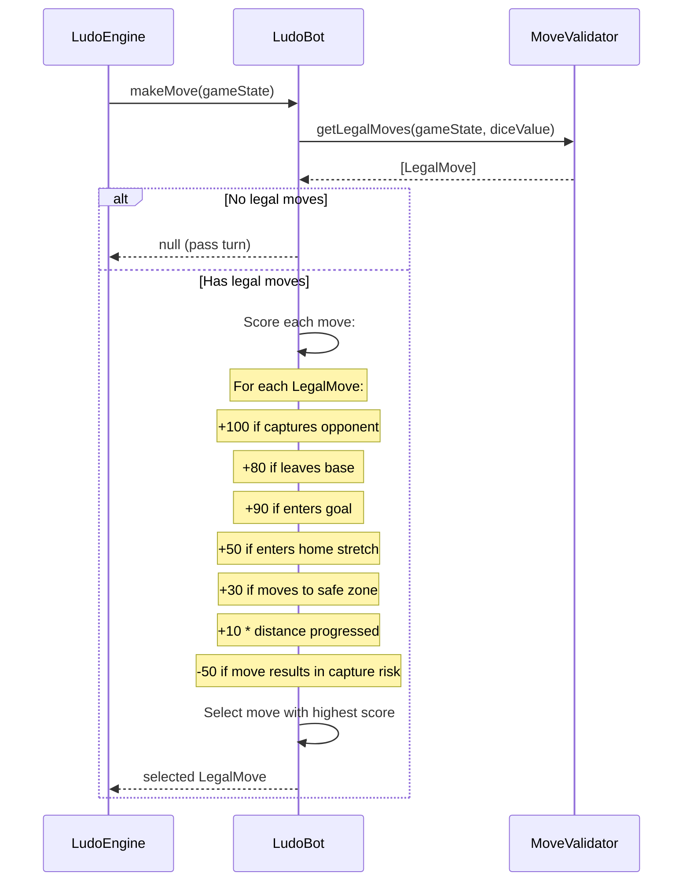

# Ludo Engine — Bot AI

## Table of Contents

- [Overview](#overview) — Heuristic-based AI opponent
- [Files](#files) — Every source file and its role
- [Key Types / Interfaces](#key-types--interfaces) — Bot configuration and decision types
- [Core Logic / Flow](#core-logic--flow) — Mermaid sequence diagram of bot decision process
- [Logic Paths Summary](#logic-paths-summary) — Decision tree for move selection
- [Dependencies](#dependencies) — Internal dependencies

---

## Overview

The Bot AI module provides an automated opponent for single-player games. It uses a heuristic-based approach to select the best move from the available legal moves. The bot:

1. **Evaluates all legal moves** — scores each possible move based on strategic criteria.
2. **Prioritizes high-value moves** — captures, escaping jail, entering the home stretch, and progressing toward goal.
3. **Simulates human-like play** — with configurable delay to mimic thinking time.

---

## Files

| File | Role |
|------|------|
| `bot.ts` | LudoBot class with heuristic-based move selection algorithm |

---

## Key Types / Interfaces

### Bot Decision Weights

```typescript
const WEIGHTS = {
  CAPTURE: 100,           // Capturing an opponent piece
  LEAVE_BASE: 80,         // Moving a piece out of base (requires rolling 6)
  ENTER_GOAL: 90,         // Moving a piece into the goal
  ENTER_HOME_STRETCH: 50, // Entering the final home stretch
  SAFE_ZONE: 30,          // Moving to a safe zone position
  PROGRESS: 10,           // General forward progress
  AVOID_CAPTURE: -50,     // Moving to a position where opponent can capture
};
```

---

## Core Logic / Flow

### Bot Move Decision

Sequence of steps when the bot evaluates and selects a move.


---

## Logic Paths Summary

### Bot Move Selection Path
```
makeMove(gameState)
  ├── Get legal moves from MoveValidator
  │   ├── No legal moves → return null (pass turn)
  │   └── Has legal moves → evaluate each:
  │       ├── Score = 0
  │       ├── +100 if move captures opponent piece
  │       ├── +90 if move enters goal
  │       ├── +80 if move leaves base (requires rolling 6)
  │       ├── +50 if move enters home stretch
  │       ├── +30 if move lands on safe zone
  │       ├── +10 * steps progressed toward goal
  │       ├── -50 if move results in opponent capture next turn
  │       └── Select move with highest score
  └── Return selected move
```

---

## Dependencies

| Dependency | Purpose |
|-----------|---------|
| `MoveValidator` | Provides legal moves for evaluation |
| `LudoEngine` | Provides game state and executes bot moves |