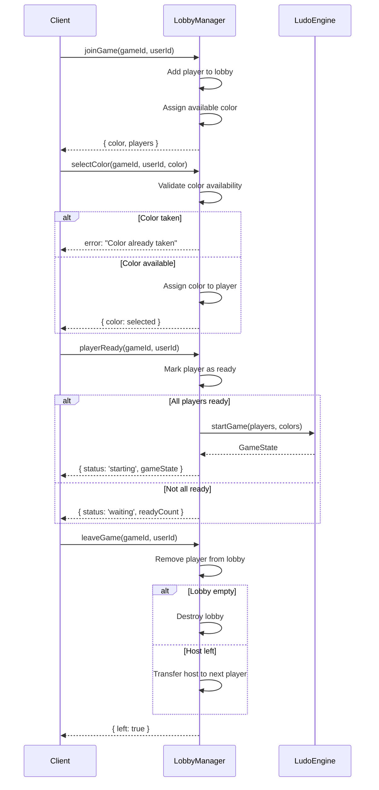
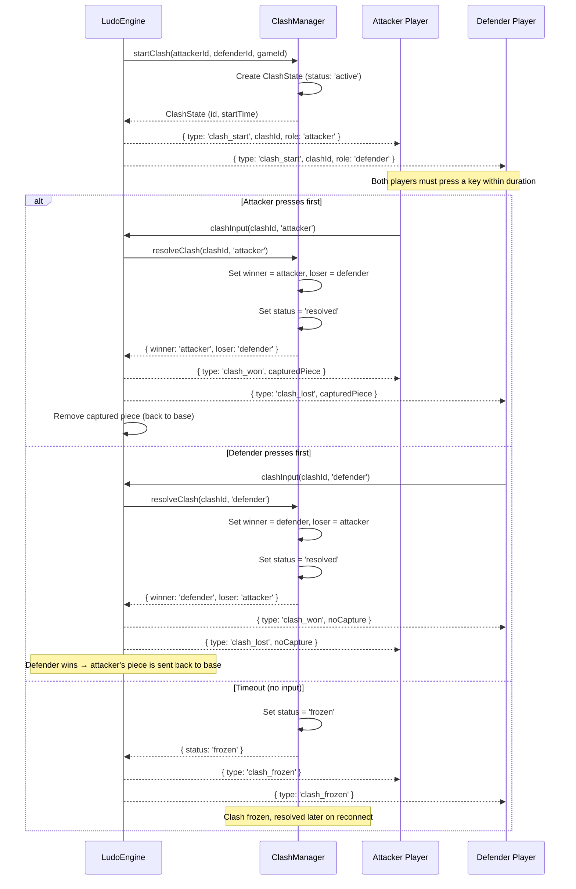

# Ludo Engine — Lobby & Clash

## Table of Contents

- [Overview](#overview) — Lobby management and clash minigame
- [Files](#files) — Every source file and its role
- [Key Types / Interfaces](#key-types--interfaces) — Lobby and clash state types
- [Core Logic / Flow](#core-logic--flow) — Mermaid sequence diagrams for lobby lifecycle and clash resolution
- [Logic Paths Summary](#logic-paths-summary) — Decision trees for each operation
- [Dependencies](#dependencies) — Internal dependencies

---

## Overview

The Lobby and Clash modules handle two distinct gameplay phases:

1. **Lobby management** — handles pre-game setup: player join/leave, color selection, ready state, and game start trigger.
2. **Clash minigame** — when a piece lands on an opponent's piece, a clash (capture minigame) is triggered. Both players must rapidly press a key; the faster player wins.

---

## Files

| File | Role |
|------|------|
| `lobby.ts` | LobbyManager for color selection, ready check, player join/leave |
| `clash.ts` | ClashManager for the capture minigame (key-press battle between attacker/defender) |

---

## Key Types / Interfaces

### Lobby State

```typescript
interface LobbyState {
  gameId: string;
  hostId: string;
  players: LobbyPlayer[];
  availableColors: PlayerColor[];
  status: 'waiting' | 'ready' | 'starting';
  createdAt: number;
}

interface LobbyPlayer {
  userId: string;
  username: string;
  color: PlayerColor | null;
  isReady: boolean;
  isBot: boolean;
}
```

### ClashState

```typescript
interface ClashState {
  id: string;
  gameId: string;
  attacker: {
    playerId: string;
    pieceId: string;
  };
  defender: {
    playerId: string;
    pieceId: string;
  };
  startTime: number;
  duration: number;        // Max time for response (e.g. 5000ms)
  status: 'active' | 'frozen' | 'resolved';
  winner: string | null;   // userId of the winner
  loser: string | null;    // userId of the loser
}
```

---

## Core Logic / Flow

### 1. Lobby Lifecycle

Sequence of steps from lobby creation to game start.


### 2. Clash Minigame

Sequence of steps when a capture triggers a clash between attacker and defender.


---

## Logic Paths Summary

### Lobby Join Path
```
joinGame(gameId, userId)
  ├── Add player to lobby
  ├── Assign first available color
  └── Return { color, players }
```

### Lobby Color Selection Path
```
selectColor(gameId, userId, color)
  ├── Check color availability
  │   ├── Taken → error
  │   └── Available → assign to player
  └── Return { color }
```

### Lobby Ready Path
```
playerReady(gameId, userId)
  ├── Mark player as ready
  ├── Check if all players ready
  │   ├── Yes → engine.startGame(), return { status: 'starting' }
  │   └── No → return { status: 'waiting', readyCount }
```

### Clash Start Path
```
startClash(attackerId, defenderId, gameId)
  ├── Create ClashState (status: 'active')
  ├── Notify attacker and defender
  └── Wait for input (up to duration ms)
```

### Clash Resolution Path
```
resolveClash(clashId, responder)
  ├── Determine winner (first responder)
  ├── Attacker wins → defender piece sent to base
  ├── Defender wins → attacker piece sent to base
  ├── Timeout → clash frozen, resolved on reconnect
  └── Notify both players of result
```

---

## Dependencies

| Dependency | Purpose |
|-----------|---------|
| `LudoEngine` | Provides game state, executes piece capture/removal |
| `EventPublisher` | Publishes clash events to Redis pub/sub |