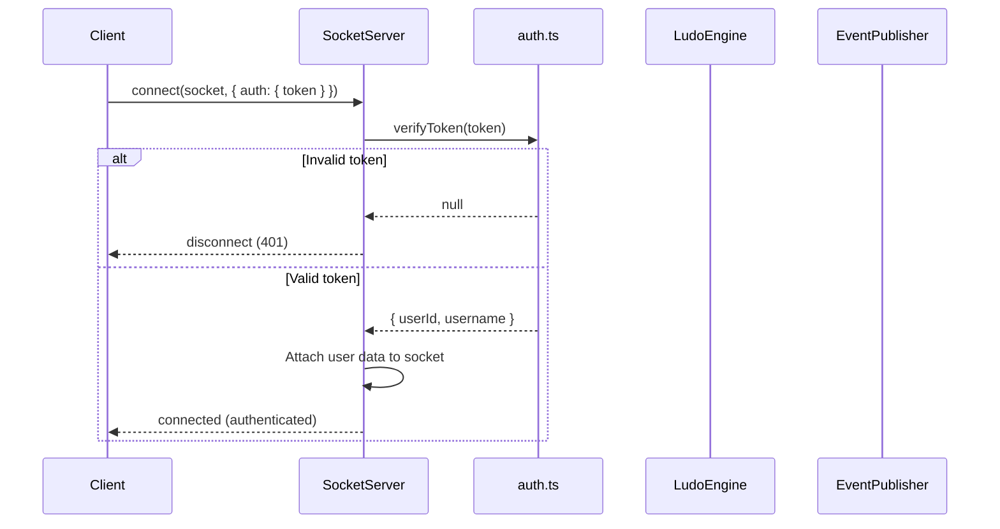
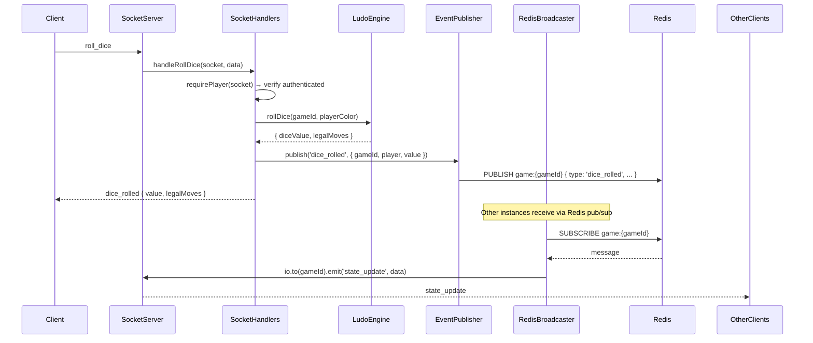
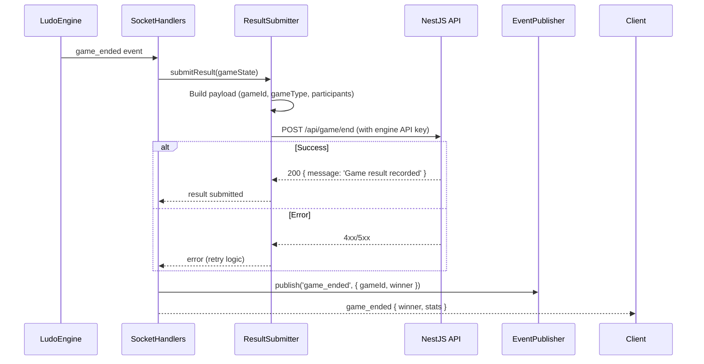
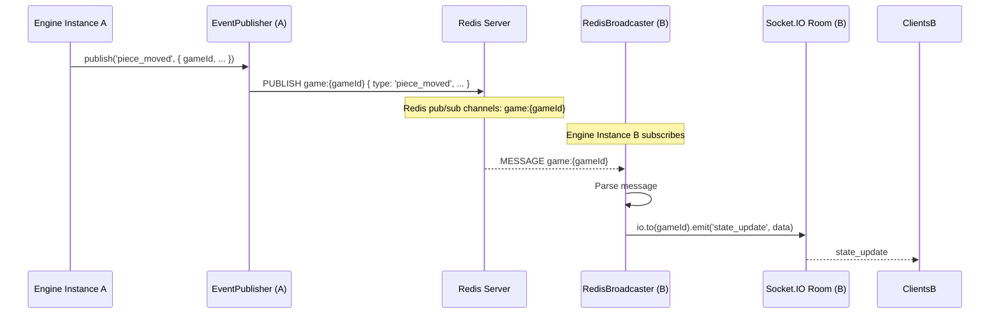

# Ludo Engine — Socket Layer

## Table of Contents

- [Overview](#overview) — Socket.IO server, client event handling, and Redis pub/sub integration
- [Files](#files) — Every source file in the module and its role
- [Key Types / Interfaces](#key-types--interfaces) — Socket data types and event names
- [Core Logic / Flow](#core-logic--flow) — Mermaid sequence diagrams for connection, event handling, and Redis broadcasting
- [Logic Paths Summary](#logic-paths-summary) — Decision trees for each operation
- [Dependencies](#dependencies) — Internal and external dependencies

---

## Overview

The Socket Layer is the communication backbone of the Ludo Engine. It provides:

1. **Socket.IO server** — handles real-time bidirectional communication between clients and the game engine.
2. **JWT authentication** — validates socket connections using the same JWT token from the NestJS backend.
3. **Event handling** — processes client events like `join_game`, `roll_dice`, `move_piece`, `clash_input`, etc.
4. **Redis pub/sub** — publishes game events to Redis channels and subscribes for multi-instance broadcasting.
5. **Result submission** — sends game results to the NestJS backend API via HTTP.

---

## Files

| File | Role |
|------|------|
| `server.ts` | SocketServer class — orchestrates the engine, Redis, Socket.IO, bot management, rematch voting, lobby expiry |
| `socket-handlers.ts` | SocketHandlers class — handlers for join_game, roll_dice, move_piece, clash_input, player_ready, select_color, leave_game, etc. |
| `auth.ts` | JWT token verification, SocketData interface, GameSocket type, requirePlayer helper, constants |
| `event-publisher.ts` | EventPublisher class — publishes game lifecycle events to Redis pub/sub |
| `redis-broadcaster.ts` | RedisBroadcaster class — subscribes to game:* Redis channels and forwards to Socket.IO rooms |
| `result-submitter.ts` | ResultSubmitter class — submits game results to backend API via HTTP POST with engine API key |

---

## Key Types / Interfaces

### GameSocket

```typescript
interface SocketData {
  userId: string;
  username: string;
}

type GameSocket = Socket<ClientEvents, ServerEvents, any, SocketData>;
```

### Event Names

**Client → Server:**
- `join_game` — Join a game room
- `roll_dice` — Roll the dice
- `move_piece` — Move a piece
- `clash_input` — Respond to a clash
- `player_ready` — Mark as ready
- `select_color` — Select a color
- `leave_game` — Leave the game
- `rematch_vote` — Vote for rematch

**Server → Client:**
- `state_update` — Full game state update
- `dice_rolled` — Dice result
- `piece_moved` — Piece movement
- `clash_start` — Clash minigame started
- `clash_result` — Clash minigame result
- `game_ended` — Game over
- `lobby_update` — Lobby state change
- `error` — Error message

---

## Core Logic / Flow

### 1. Socket Connection & Authentication

Sequence of steps when a client connects to the Socket.IO server.


### 2. Game Event Flow (Roll Dice Example)

Sequence of steps when a client rolls the dice.


### 3. Game End & Result Submission

Sequence of steps when a game ends.


### 4. Redis Broadcasting

Sequence of steps showing how game state is broadcast across multiple engine instances.


---

## Logic Paths Summary

### Connection Path
```
connect(socket, { auth: { token } })
  ├── verifyToken(token)
  │   ├── Invalid → disconnect (401)
  │   └── Valid → attach { userId, username } to socket.data
  └── Connection established
```

### Event Handler Path (Generic)
```
socket.on('{event}', data)
  ├── requirePlayer(socket) → verify authenticated
  ├── Execute handler (e.g., rollDice, movePiece)
  ├── Publish event to Redis pub/sub
  └── Emit result back to client
```

### Game End Path
```
game_ended detected
  ├── Build result payload (gameId, gameType, participants)
  ├── POST /api/game/end (with engine API key)
  │   ├── 200 → success
  │   └── Error → retry
  ├── Publish game_ended event to Redis
  └── Emit game_ended to all players in room
```

### Redis Broadcast Path
```
Redis PUBLISH game:{gameId} { type, data }
  └── All subscribed instances:
      ├── Parse message
      └── io.to(gameId).emit('state_update', data)
```

---

## Dependencies

| Dependency | Purpose |
|-----------|---------|
| `socket.io` | Real-time WebSocket communication |
| `ioredis` | Redis client for pub/sub and data storage |
| `jsonwebtoken` | JWT verification for socket authentication |
| `axios` | HTTP client for submitting game results to backend |
| `LudoEngine` | Core game logic |
| `LobbyManager` | Pre-game lobby management |
| `ClashManager` | Clash minigame management |
| `RedisGameStore` | Persistence layer for game state |

---

## Configuration / Environment

| Variable | Default | Used By |
|----------|---------|---------|
| `JWT_SECRET` | (from env) | Socket auth token verification |
| `ENGINE_API_KEY` | (from env) | Result submission to backend |
| `BACKEND_URL` | `http://backend:3000` | Result submission target URL |
| `REDIS_URL` | (from env) | Redis connection for pub/sub |
| `PORT` | `3001` | Socket.IO server listen port |