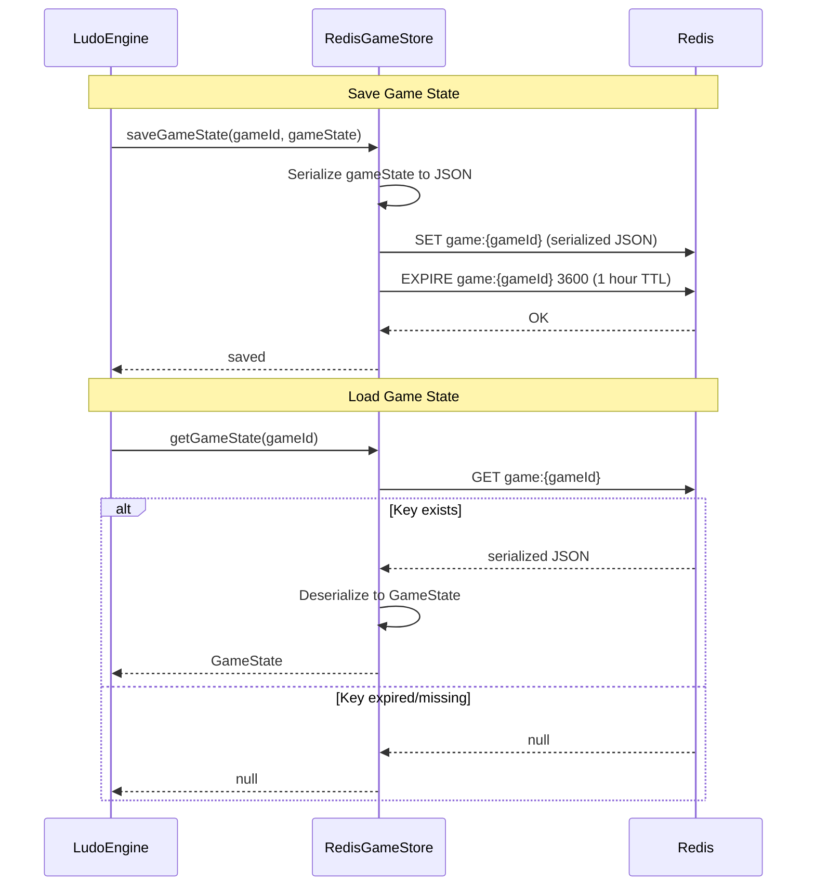
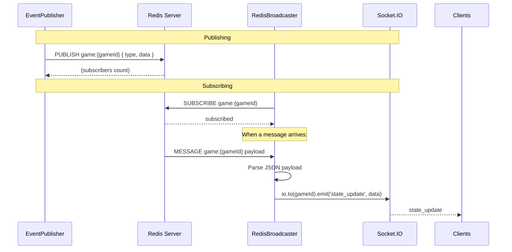

# Ludo Engine — Redis Infrastructure

## Table of Contents

- [Overview](#overview) — Redis client setup and game state persistence
- [Files](#files) — Every source file and its role
- [Key Types / Interfaces](#key-types--interfaces) — Redis key patterns and data structures
- [Core Logic / Flow](#core-logic--flow) — Mermaid sequence diagrams for state persistence and pub/sub
- [Data Structures](#data-structures) — Redis key patterns and value formats
- [Dependencies](#dependencies) — External dependencies

---

## Overview

The Redis Infrastructure module provides the data persistence and messaging layer for the Ludo Engine. It uses Redis for:

1. **Game state persistence** — stores active game states in Redis so they survive engine restarts and allow reconnection.
2. **Pub/sub messaging** — publishes game events to Redis channels for cross-instance broadcasting.
3. **Leaderboard caching** — (see Leaderboard module) cached leaderboard data in Redis sorted sets.

---

## Files

| File | Role |
|------|------|
| `redis.ts` | RedisGameStore class — persistence layer using ioredis for game state, clash state, and lobby data |

---

## Key Types / Interfaces

### RedisGameStore

```typescript
class RedisGameStore {
  // Game state
  async saveGameState(gameId: string, state: GameState): Promise<void>;
  async getGameState(gameId: string): Promise<GameState | null>;
  async deleteGameState(gameId: string): Promise<void>;

  // Clash state
  async saveClashState(clashId: string, state: ClashState): Promise<void>;
  async getClashState(clashId: string): Promise<ClashState | null>;
  async deleteClashState(clashId: string): Promise<void>;

  // Lobby state
  async saveLobbyState(gameId: string, state: LobbyState): Promise<void>;
  async getLobbyState(gameId: string): Promise<LobbyState | null>;
  async deleteLobbyState(gameId: string): Promise<void>;

  // Expiration
  async setExpiry(key: string, ttl: number): Promise<void>;
}
```

---

## Core Logic / Flow

### 1. Game State Persistence

Sequence of steps showing how game state is saved and retrieved from Redis.


### 2. Pub/Sub Messaging

Sequence of steps showing how Redis pub/sub connects multiple engine instances.


---

## Data Structures

### Key Patterns

| Pattern | Type | TTL | Description |
|---------|------|-----|-------------|
| `game:{gameId}` | String | 3600s (1h) | Serialized GameState JSON |
| `clash:{clashId}` | String | 3600s (1h) | Serialized ClashState JSON |
| `lobby:{gameId}` | String | 3600s (1h) | Serialized LobbyState JSON |
| `leaderboard:{mode}:{page}:{limit}` | String | 300s (5m) | Cached leaderboard entries |

### Value Format

All game-related values are stored as JSON-serialized strings:

```json
// game:{gameId}
{
  "gameId": "uuid",
  "players": [...],
  "pieces": [...],
  "currentTurn": "red",
  "diceValue": 4,
  "phase": "moving",
  "winner": null,
  "turnOrder": ["red", "blue", "green", "yellow"],
  "moveHistory": [],
  "startedAt": 1700000000000,
  "lastMoveAt": 1700000005000
}
```

---

## Logic Paths Summary

### Save Game State Path
```
saveGameState(gameId, gameState)
  ├── Serialize gameState to JSON
  ├── SET game:{gameId} (serialized JSON)
  ├── EXPIRE game:{gameId} 3600
  └── Return "saved"
```

### Load Game State Path
```
getGameState(gameId)
  ├── GET game:{gameId}
  │   ├── Found → Deserialize JSON to GameState, return it
  │   └── Not found → return null
```

### Publish Event Path
```
publish(eventType, data)
  ├── Build payload { type: eventType, ...data }
  ├── PUBLISH game:{gameId} (serialized JSON)
  └── Return subscriber count
```

### Subscribe to Channel Path
```
subscribeToGame(gameId)
  ├── SUBSCRIBE game:{gameId}
  ├── On message:
  │   ├── Parse JSON payload
  │   └── io.to(gameId).emit('state_update', data)
  └── Return subscription
```

---

## Dependencies

| Dependency | Purpose |
|-----------|---------|
| `ioredis` | Redis client for Node.js — supports pub/sub, pipelining, and cluster mode |