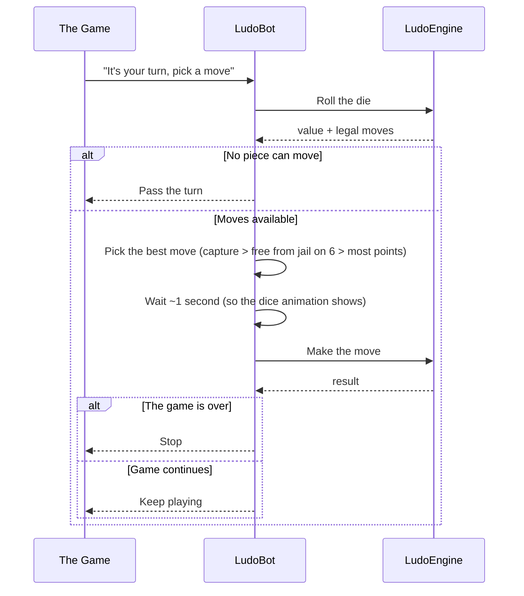
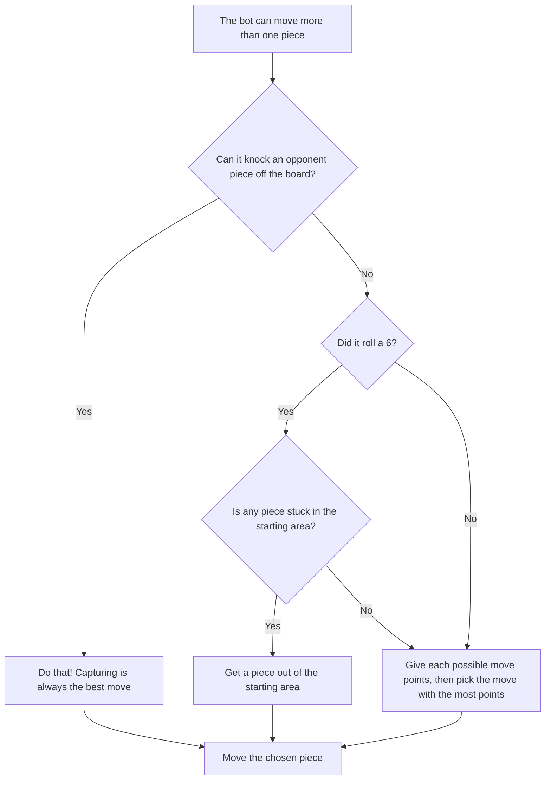

# Ludo Engine — Bot AI

## Table of Contents

- [Overview](#overview) — Heuristic-based AI opponent
- [Files](#files) — Every source file and its role
- [Key Types / Interfaces](#key-types--interfaces) — Bot helpers and decision logic
- [Core Logic / Flow](#core-logic--flow) — Sequence diagram + decision flowchart + worked board example
- [Logic Paths Summary](#logic-paths-summary) — Decision tree for move selection
- [Dependencies](#dependencies) — Internal dependencies

---

## Overview

The Bot AI module provides an automated opponent for single-player (PvE) games. The bot is created per game and per color, and it picks its moves using a simple scoring heuristic. It:

1. **Always takes captures** — if any legal move captures an opponent piece, it takes the first one.
2. **Frees pieces from jail on a 6** — if the dice is 6, it prefers moving a piece out of the base.
3. **Scores the remaining moves** — otherwise it ranks each move and picks the highest score.
4. **Mimics a human** — it waits ~1.2s before moving so the dice animation can play.

Bot turns are scheduled by the `BotTurnScheduler` (`socket/bot-scheduler.ts`, driven by `SocketServer`) — never by the bot itself — so two bot turns never overlap.

---

## Files

| File | Role |
|------|------|
| `bot.ts` | `LudoBot` class + `getOrCreateBot()` / `isBotPlayer()` helpers |

---

## Key Types / Interfaces

### Move selection priority

```typescript
// selectBestMove(legalMoves, state, diceValue)
// 1. Any move where move.isCapture === true  → take it immediately
// 2. On a 6, any move where move.from === 0   → free a piece from jail
// 3. Otherwise score each move and take the best
```

### Move scoring (`scoreMove`)

| Condition | Score added |
|---|---|
| `move.isHomeEntry` (entering goal) | +1000 |
| `move.to` lands on a safe zone | +500 |
| `move.from === 0` (leaving jail) | +100 |
| `move.to * 10` (progress along the track) | +10 per step |

---

## Core Logic / Flow

### Bot Move Decision

Sequence of steps when the bot evaluates and selects a move.


### Choosing Between Several Moves

When there are multiple options, the bot checks them in order — the first rule that fits wins. It never over-thinks it:



### Example: a real board decision

Say it's **Green**'s turn and the bot rolls a **4**. Green has three pieces on the track and none can capture, so the bot scores each option. Landing squares that are safe zones (shared positions `1, 9, 14, 22, 27, 35, 40, 48`) get a `+500` bonus, and each piece earns `+10` per step of progress:

```mermaid
flowchart LR
    subgraph board["Green's pieces on the main track — dice roll = 4"]
        direction LR
        c5["5<br/>G2 piece"] --- c6["6"] --- c7["7"] --- c8["8"] --- c9["9 ★<br/>safe"] --- c10["10<br/>G0 piece"] --- c11["11"] --- c12["12"] --- c13["13"] --- c14["14 ★<br/>safe"] --- c15["15"] --- c16["16"] --- c17["17"] --- c18["18"] --- c19["19"] --- c20["20<br/>G1 piece"] --- c21["21"] --- c22["22"] --- c23["23"] --- c24["24"]
    end

    classDef safe fill:#d9f0ff,stroke:#2a7ab5
    classDef piece fill:#b8f2b8,stroke:#1e7d1e
    class c9,c14 safe
    class c5,c10,c20 piece
```



| Option | Move | Lands on | Score (`scoreMove`) |
|---|---|---|---|
| 1 | G2 piece `5 → 9` | safe zone (★) | `9×10 + 500 = 590` |
| 2 | G0 piece `10 → 14` | safe zone (★) | `14×10 + 500 = 640` |
| 3 | G1 piece `20 → 24` | plain square | `24×10 = 240` |

The bot picks **option 2** (highest score, `640`) and moves G0 to step 14. In real games the same priority chain decides first — if any move could capture, it would take that move before scoring anything.

---

## Logic Paths Summary

### Bot Move Selection Path
```
selectBestMove(legalMoves, state, diceValue)
  ├── No legal moves → return null (pass turn)
  ├── Capture moves exist (isCapture) → return first capture
  ├── diceValue === 6 and a move from===0 exists → return it (free from jail)
  └── Otherwise score each move:
      ├── +1000 if isHomeEntry
      ├── +500 if lands on a safe zone
      ├── +100 if from === 0
      ├── +10 per step (move.to * 10)
      └── Return the highest-scoring move
```

### Bot Turn Path
takeTurn()
```
  ├── loadGameState → must be active, bot's turn, WAITING_FOR_ROLL
  ├── engine.rollDice(gameId)
  ├── Re-check state.currentTurn (may have changed on disconnect)
  ├── selectBestMove → if none, return
  ├── Wait 1.2s
  ├── engine.movePiece(gameId, pieceId)
  └── Return whether the game is still active
```

---

## Dependencies

| Dependency | Purpose |
|-----------|---------|
| `MoveValidator` | Provides the legal moves for a roll |
| `LudoEngine` | Rolls the dice and executes moves |
| `RedisGameStore` | Loads/saves game state |
| `BoardMapper` | `isSafeZoneStep()` used in move scoring |
| `socket/auth.ts` | `isBotUserId()` for bot detection |
