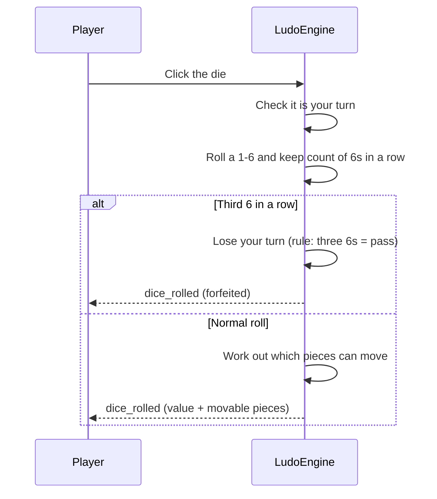
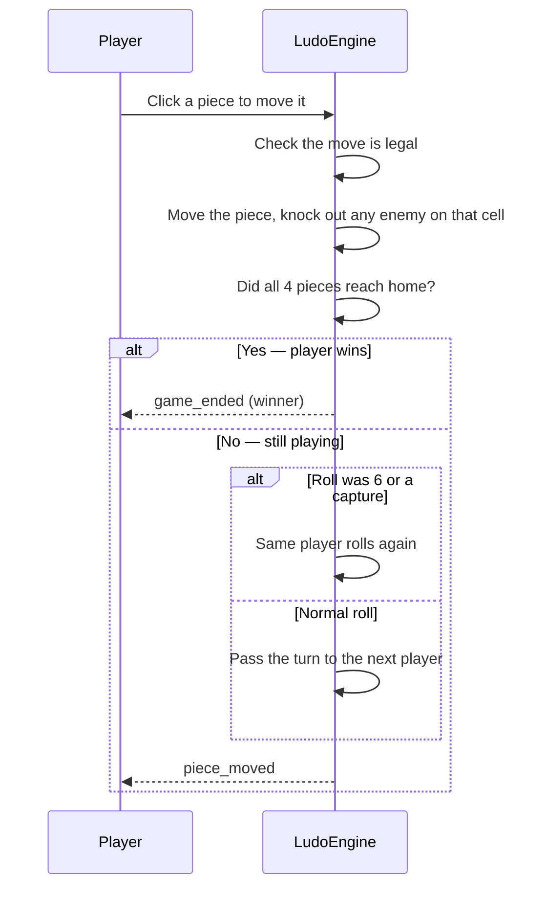

# Ludo Engine — Core Engine

## Table of Contents

- [Overview](#overview) — Game state machine, turn logic, and win conditions
- [Files](#files) — Source file inventory
- [Key Types / Interfaces](#key-types--interfaces) — GameState, PlayerColor, Piece, events
- [Core Logic / Flow](#core-logic--flow) — Mermaid sequence diagrams for game flow
- [Logic Paths Summary](#logic-paths-summary) — Decision trees for game operations
- [Dependencies](#dependencies) — Internal services this module relies on
- [Configuration](#configuration) — Environment variables

---

## Overview

The engine core is the game's referee: it runs inside the `ludo-engine` service and is the single source of truth for all game state. The engine:

1. **Manages game state** — moves games through `waiting` → `active` → `finished`.
2. **Validates moves** — uses `MoveValidator` to work out which moves are legal.
3. **Handles dice rolls** — enforces turn order, gives a bonus roll on 6, and forfeits the turn on the third consecutive 6.
4. **Tracks pieces** — each piece has a `step` value (-1=exited, 0=prison, 1-51=track, 52-56=home lane, 57=goal).
5. **Detects wins** — the first player to get all 4 pieces home wins.
6. **Saves state** — writes to Redis via `RedisGameStore` so a restart doesn't lose the game.
7. **Serializes operations** — a per-game lock ensures roll/move never run on top of each other.

---

## Files

| File | Role |
|------|------|
| `engine.ts` | `LudoEngine` — orchestrator: per-game lock, event stream, `rollDice`/`movePiece`, player-lifecycle + lobby wrappers; composes `MoveValidator`, `BoardMapper`, `RedisGameStore`, `PlayerHandler`, `LobbyManager`, `ClashEngine`, and `applyMoveOutcome` (`turn.ts`) |
| `clash-engine.ts` | `ClashEngine` — clash QTE orchestration: phase timers, recovery sweep, bot pressers, press recording, deferred-capture resolution |
| `turn.ts` | `applyMoveOutcome` — shared move-completion (stats, win check, bonus/turn advance) used by `movePiece` and clash resolution |
| `types.ts` | Type definitions: `GameState`, `PlayerMeta`, `Piece`, `LegalMove`, `MoveResult`, `GameEvent` |
| `move-validator.ts` | Legal move computation based on board geometry |
| `board-mapper.ts` | Board geometry — safe zones, track positions, goal entries |
| `clash.ts` | Clash constants + `ClashManager` (start, press validation, publish) |
| `redis.ts` | `RedisGameStore` — Redis persistence layer |
| `bot.ts` | Heuristic bot AI |
| `player-handler.ts` | Disconnect/reconnect/exit/ready management and turn advance |
| `lobby.ts` | Lobby management — color selection, ready check |
| `index.ts` | Entry point — starts Socket.IO server on port 3001 |

---

## Key Types / Interfaces

### PlayerColor

```typescript
export type PlayerColor = 'red' | 'green' | 'yellow' | 'blue';
```

### Piece

```typescript
export interface Piece {
  id: PieceId;           // e.g. "red-0"
  color: PlayerColor;    // Owner color
  step: number;          // -1=exited, 0=prison, 1-51=track, 52-56=home lane, 57=goal
  isInGoal?: boolean;    // true when step === 57
  isInBase?: boolean;    // true when step <= 0
}
```

### PlayerMeta

```typescript
export interface PlayerMeta {
  color: PlayerColor;    // Seat color
  status: 'active' | 'exited' | 'inactive' | 'disconnected';  // Player lifecycle state
  username: string;      // Seat/display name
  displayName?: string;  // Optional display name
  isBot: boolean;        // Whether this seat is a bot
  isConnected: boolean;  // Whether the player's socket is connected
  piecesInGoal: number;  // Pieces finished (0-4)
  hasRolled: boolean;    // Whether the player rolled this turn
  consecutiveSixes: number;  // Per-player six streak, resets on turn advance
  bonusRoll: boolean;    // Rolled a 6 → rolls again
  isFinished: boolean;   // true when all 4 pieces in goal
  finishedAt?: string;   // ISO timestamp
  stats: { turns: number; captures: number; piecesInGoal: number; clashDefends: number; clashAttacksWon: number };  // Per-game counters
}
```

### GameState

```typescript
export interface GameState {
  id: string;                      // Unique game id
  pieces: Piece[];                 // 16 pieces: 4 per player × 4 players
  players: PlayerMeta[];           // Per-seat player info
  currentTurn: PlayerColor;        // Whose turn it is
  consecutiveSixes: number;        // Current 6-streak (third 6 forfeits the turn)
  moveCounter: number;             // Total moves made in the game
  turnPhase: 'WAITING_FOR_ROLL' | 'WAITING_FOR_MOVE';  // Roll phase or move phase
  firstRollOfTurn: boolean;        // True until the six-bonus has been used once during the current turn-holding streak
  pendingLegalMoves: LegalMove[];  // authoritative legal moves after a roll
  pendingDiceValue?: number;       // Dice value from the most recent roll
  pendingIsFirstRoll?: boolean;    // Whether the pending roll was the first of the turn
  disconnectedPlayers: DisconnectState[];  // Players in their disconnect grace period
  status: 'waiting' | 'active' | 'finished';  // Game lifecycle state
  winner?: PlayerColor;            // Winner color when finished
  resultDetail?: string;           // Human-readable finish reason
  resultSubmitted?: boolean;       // prevents duplicate backend submissions
  botBusy?: boolean;               // prevents overlapping bot turns
  clash?: ClashState;              // Active clash QTE, if any
  clashMode: boolean;              // Clash minigame on vs standard capture
  safeZones: boolean;              // Safe/star squares capture-immune
  readyPlayers: PlayerColor[];     // Players who clicked "ready"
  pendingCapture?: PendingCapture; // Capture deferred until the clash resolves
  resultCardUntil?: number;        // Input freeze while the clash result card shows
  paused?: boolean;                // Whether the game is paused
  pauseTurnOwner?: PlayerColor;    // Whose turn it was when paused
}
```

### LegalMove & MoveResult

```typescript
export interface LegalMove {
  pieceId: PieceId;    // Which piece can move
  from: number;        // Starting step
  to: number;          // Landing step
  isCapture: boolean;  // Whether this move captures an opponent piece
  isHomeEntry: boolean; // Whether this move enters the home lane
}

export interface MoveResult {
  ply: number;                 // Move number (increments each move)
  color: PlayerColor;          // Player who moved
  diceValue: number;           // The roll that produced the move
  pieceId: PieceId;            // Which piece moved
  from: number;                // Starting step
  path: number[];              // every intermediate step, for step-by-step animation
  to: number;                  // Landing step
  captured: boolean;           // Whether this move captured a piece
  capturedPieceIds?: PieceId[];  // all opponent pieces sent home from the landing square
  enteredHome: boolean;        // Whether the piece entered the home lane
  bonusRoll: boolean;          // Rolled a 6 → rolls again
  clashOutcome?: 'attacker_won' | 'defender_won';  // Set when this move ended a clash
}
```

### GameEvent

One source of truth for game lifecycle — the engine emits these, and the socket layer relays them:

```typescript
export type GameEvent =
  | { type: 'dice_rolled'; gameId; value; legalMoves; bonusRoll; currentTurn; forfeited? }      // A roll happened; carries the value + legal moves (+ forfeited on third 6)
  | { type: 'piece_moved'; gameId; result: MoveResult }                                         // A piece moved; full MoveResult payload
  | { type: 'game_ended'; gameId; winner; resultDetail }                                        // Game finished; winner + reason
  | { type: 'game_started'; gameId }                                                            // Game transitioned from waiting → active
  | { type: 'player_exited'; gameId; color }                                                    // A player left / was removed
  | { type: 'player_aborted'; gameId; color; username }                                         // A player aborted the game
  | { type: 'player_disconnected'; gameId; color }                                              // A player's connection dropped
  | { type: 'player_reconnected'; gameId; color }                                               // A player reconnected
  | { type: 'clash_start'; gameId; attackerKey; defenderKey; attacker; defender; ... }           // Clash QTE began (keys + phase deadlines)
  | { type: 'clash_phase'; gameId; phase }                                                      // Clash advanced phase (announce → countdown → pressing)
  | { type: 'clash_press'; gameId; color; presses }                                             // A side landed a press (live meters)
  | { type: 'clash_result'; gameId; winner; loser; winnerPresses; loserPresses }                // Clash resolved; deferred capture applied
  | { type: 'color_selected'; gameId; userId; color }                                           // A player picked a color in the lobby
  | { type: 'lobby_update'; gameId; players };                                                  // Lobby seats changed
  | { type: 'modifiers_updated'; gameId; clashEnabled; safeZones };                             // Host changed the game rules
```

---

## Core Logic / Flow

### 1. Dice Roll



#### How the roll's randomness works (seeded PRNG math)

The roll uses a seeded PRNG (`LudoEngine.seededRand`, mulberry32) because
`Math.random()` cannot be seeded directly. Each roll creates a fresh generator,
seeded with a `Math.random()` value stretched to a very large number, so every
roll gets its own random stream that other `Math.random()` calls in the process
cannot influence.

The generator keeps a single piece of internal state: the 32-bit integer `s`,
initialised from the seed (`>>> 0` normalises the seed to an unsigned 32-bit
value).

**1. Advance the state**

```js
s = (s + 0x6D2B79F5) | 0
```

A fixed constant is added with 32-bit wraparound (`| 0` forces the result back
into a 32-bit integer). The constant is odd, which makes the step reversible:
the state can never get stuck, and the generator walks through all 2³² possible
states before repeating. `0x6D2B79F5` is a tuned constant from the original
mulberry32 design.

**2. Scramble the state into an output value `t`**

```js
t = Math.imul(s ^ (s >>> 15), 1 | s)
```

- `s >>> 15` slides the high bits down, and `s ^ ...` mixes the high and low
  halves together — an "xorshift" that diffuses the bits.
- `Math.imul` is true 32-bit multiplication (plain `*` would lose precision on
  numbers this large). The multiplier `1 | s` is forced to be odd, which makes
  the multiplication invertible mod 2³² — so the scramble can never collapse
  two different states into one output, and the full 2³² period is preserved.
- The whole line is repeated with different constants (shift 7, multiplier 61)
  and XORed in, spreading the bits even further.

**3. Map to [0, 1)**

```js
return ((t ^ (t >>> 14)) >>> 0) / 4294967296
```

One last xorshift mixes the bits, `>>> 0` reinterprets `t` as an unsigned
32-bit integer (0 .. 2³² − 1), and dividing by 2³² squeezes that into a
decimal in [0, 1).

The odd multipliers keep the generator a bijection (every output maps back to a
unique state), while the xorshift + multiply steps make consecutive outputs
look statistically random. The period is 2³² — far more rolls than a single
game will ever need.

**From the generator to a die face** — `rollDice` takes a single value `u ∈ [0, 1)`
from the stream and computes `Math.floor(u * 6) + 1`, which gives every face
1–6 an equal 1/6 chance (a fair die, maximum entropy ≈ 2.585 bits).

### 2. Move Piece



---

## Logic Paths Summary

### Dice Roll Path
```
roll_dice()
  ├── Validate game active, turnPhase WAITING_FOR_ROLL, caller is current player
  ├── Roll 1-6
  ├── 6 → consecutiveSixes++ ; otherwise reset to 0
  ├── Third consecutive 6 → forfeit turn (forfeited: true), advance, return
  ├── 6 → bonusRoll = true
  ├── pendingLegalMoves = MoveValidator.getLegalMoves(...)
  ├── turnPhase = WAITING_FOR_MOVE
  └── Emit dice_rolled { value, legalMoves, bonusRoll }
```

### Move Piece Path
```
move_piece(pieceId)
  ├── Validate game active and turnPhase = WAITING_FOR_MOVE
  ├── Verify pieceId is in pendingLegalMoves (server snapshot from the roll)
  ├── Clash gate: if clashMode + capture → defer to ClashEngine (pendingCapture → QTE → resolveClashOutcome)
  ├── executeMove → move the piece; resolve any captures immediately (captured pieces → base)
  ├── recordMove (history) + applyMoveOutcome (turn.ts): moveCounter++, stats, win check, bonus/turn advance
  ├── Check win condition (all 4 pieces at step 57)
  │   ├── Win → status='finished', emit game_ended
  │   └── No win → sync piecesInGoal
  │       ├── Roll was 6 OR move captured → same player rolls again (bonus roll)
  │       └── Roll 1-5, no capture → advance turn to next player
  ├── Clear pendingLegalMoves + pendingDiceValue
  └── saveGameState; emit piece_moved (+ game_ended if finished)
```

---

## Dependencies

| Dependency | Purpose |
|-----------|---------|
| `MoveValidator` | Legal move computation |
| `BoardMapper` | Board geometry, safe zones, track positions |
| `RedisGameStore` | Redis persistence for game state |
| `player-handler` | Disconnect/reconnect/exit/ready + `advanceTurnInState` |
| `LobbyManager` | Color selection and ready check |
| `ClashEngine` | Clash QTE orchestration (phase timers, pressers, deferred-capture resolution) |
| `applyMoveOutcome` (`turn.ts`) | Shared move-completion (stats, win check, bonus/turn advance) |

---

## Configuration

| Variable | Default | Used By |
|----------|---------|---------|
| `REDIS_HOST` | `redis` | RedisGameStore |
| `REDIS_PORT` | `6479` | RedisGameStore |
| `REDIS_PASSWORD` | (from secrets) | RedisGameStore |
| `BACKEND_URL` | `http://localhost:3000` | ResultSubmitter |
| `ENGINE_API_KEY` | (from secrets) | ResultSubmitter |

### Tunable constants

Module-level constants in the engine's support files — edit at the top of each file to tweak:

| Constant | File | Default | What it controls |
|----------|------|---------|------------------|
| `DISCONNECT_GRACE_MS` | `player-handler.ts` | 45 s | PvP reconnect window before a disconnected player is pruned |
| `BOT_DISCONNECT_GRACE_MS` | `player-handler.ts` | 1 h | Bot-mode reconnect window before the game auto-aborts |
| `DISCONNECT_PRUNE_BUFFER_MS` | `player-handler.ts` | 1 s | Extra delay so the PvP prune timer fires after the reconnect deadline |
| `CLASH_ANNOUNCE_MS` | `clash.ts` | 1500 ms | "CLASH!" flash before keys appear |
| `CLASH_COUNTDOWN_MS` | `clash.ts` | 3000 ms | 3-2-1 countdown (keys hidden) |
| `CLASH_PRESS_MS` | `clash.ts` | 5000 ms | Press-race window |
| `CLASH_RESULT_MS` | `clash.ts` | 2000 ms | Result card shown client-side |
| `CLASH_RESULT_FREEZE_MS` | `clash.ts` | 4000 ms | Server-side input freeze after a clash resolves (must exceed the client card) |
| `CLASH_TARGET` | `clash.ts` | 42 | Presses needed to win a clash |
| `CLASH_PRESS_CAP_MS` | `clash.ts` | 110 ms | Min gap between accepted presses per side (~9 Hz ceiling — at elite-human max, so macros can't out-press a human) |
| `CLASH_SWEEP_GRACE_MS` | `clash.ts` | 15 s | Recovery sweep force-resolves orphaned clashes older than this |
| `CLASH_SWEEP_INTERVAL_MS` | `clash-engine.ts` | 5 s | Cadence of the clash recovery sweep |
