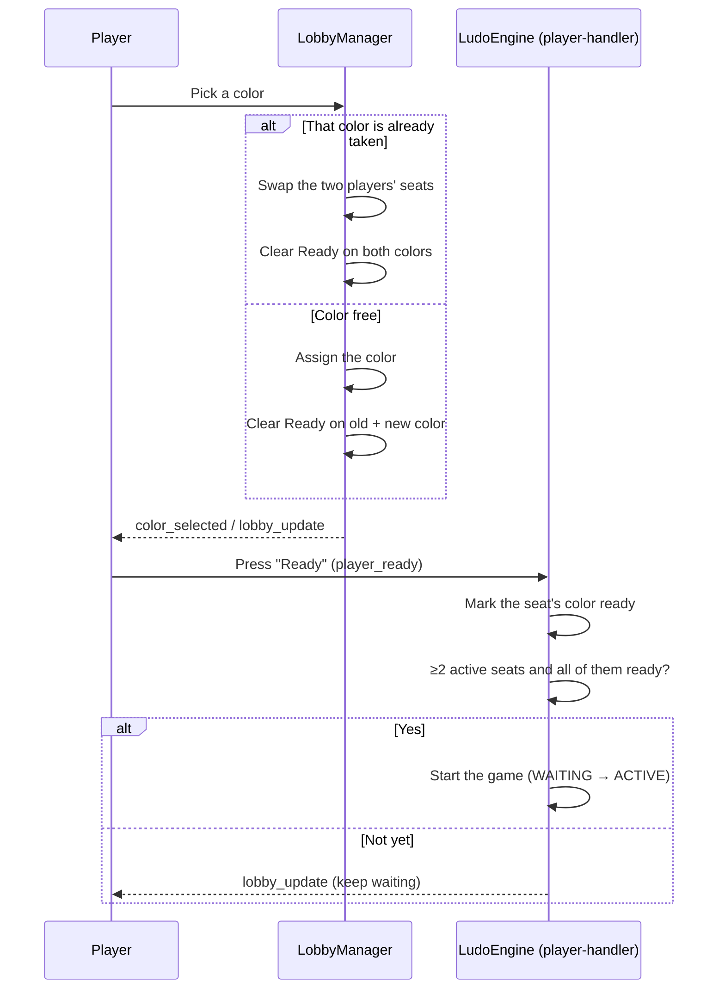

# Ludo Engine — Lobby

## Table of Contents

- [Overview](#overview) — Lobby management
- [Files](#files) — Every source file and its role
- [Key Types / Interfaces](#key-types--interfaces) — Lobby state types
- [Core Logic / Flow](#core-logic--flow) — Mermaid sequence diagram for the lobby lifecycle
- [Logic Paths Summary](#logic-paths-summary) — Decision trees for each operation
- [Dependencies](#dependencies) — Internal dependencies

---

## Overview

The Lobby module handles the pre-game setup: players join and leave, pick
colors, mark ready, and trigger the start.

---

## Files

| File | Role |
|------|------|
| `lobby.ts` | `LobbyManager` — color selection (with swap); readiness lives in the engine GameState |

---

## Key Types / Interfaces

### Lobby data

The **match metadata hash** (`match:{gameId}`) tracks seats — `player1_id`,
`player1_color`, `status`, `gameType`, etc. Readiness is NOT stored there: the
roster and ready flags live in the engine GameState (`state.players` +
`state.readyPlayers`), which `emitLobbyUpdate` broadcasts to clients.

---

## Core Logic / Flow

### 1. Lobby Lifecycle



---

## Logic Paths Summary

### Color Selection Path
```
select_color(color)
  ├── Game must be WAITING
  ├── Color out of seat count → error
  ├── Color taken by someone else → swap the two players' seats
  ├── Color free → assign
  ├── Mirror swap into engine GameState (seat identity only, pre-game)
  ├── Clear the Ready flag on both colors involved (re-confirm after a change)
  └── Emit color_selected / lobby_update
```

### Ready Check Path
```
player_ready
  ├── Mark the seat's color ready in engine GameState (state.readyPlayers)
  ├── ≥2 active seats AND every active seat's color is ready?
  │   ├── Yes → start the game (WAITING → ACTIVE)
  │   └── No → keep waiting (lobby_update)
```

---

## Dependencies

| Dependency | Purpose |
|-----------|---------|
| `RedisGameStore` | Match seats/colors/status + GameState persistence |
| `EventPublisher` | Publishes lobby events to Redis pub/sub |
| `LudoEngine` | Game state and the ready/start gate (player-handler, join-manager) |
