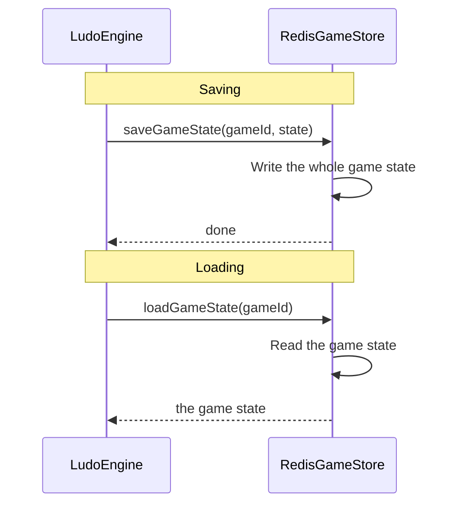
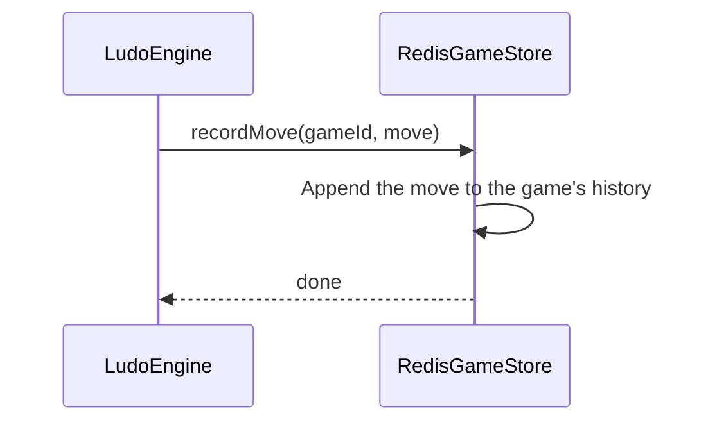
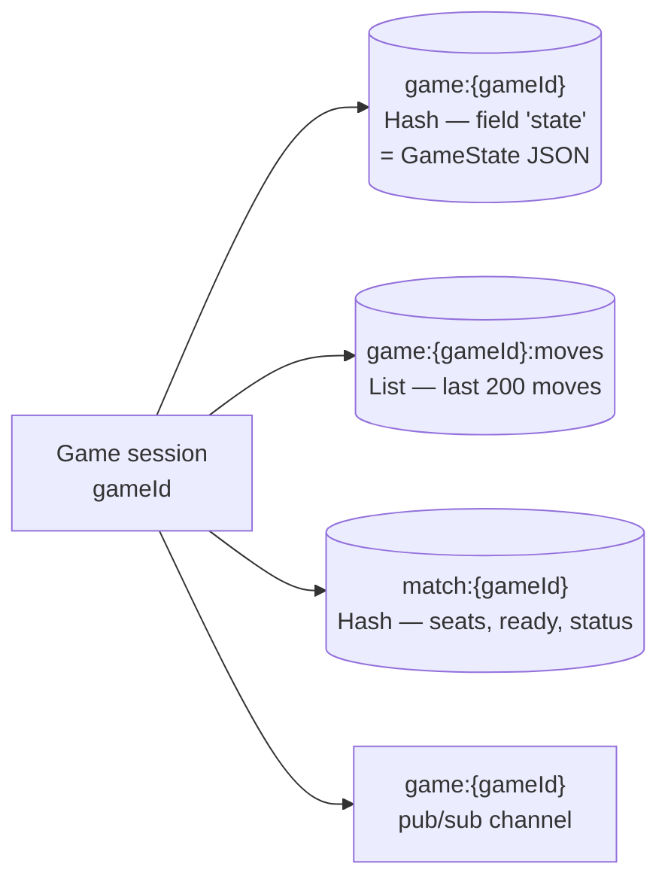
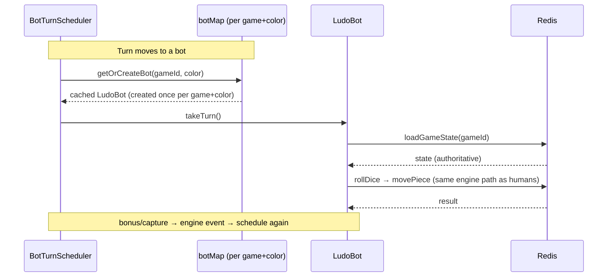

# Ludo Engine — Redis Infrastructure

## Table of Contents

- [Overview](#overview) — Redis client setup and game state persistence
- [Files](#files) — Every source file and its role
- [Key Types / Interfaces](#key-types--interfaces) — Redis key patterns and data structures
- [Core Logic / Flow](#core-logic--flow) — Mermaid sequence diagrams for state persistence and pub/sub
- [What Redis Spawns Per Game Session](#what-redis-spawns-per-game-session) — The 3 keys created per game
- [How the Engine Handles Multiple Bots](#how-the-engine-handles-multiple-bots) — Cached per-color bot instances + server-driven turns
- [Piece-Level State](#piece-level-state-why-no-board-is-ever-built) — Why no board is ever built (incl. memory footprint + grid comparison)
- [Data Structures](#data-structures) — Redis key patterns and value formats
- [Dependencies](#dependencies) — External dependencies

---

## Overview

The Redis Infrastructure module provides the persistence and messaging layer for the Ludo Engine. It uses Redis for:

1. **Game state persistence** — stores active game state in Redis so games survive engine restarts and players can reconnect.
2. **Move history** — keeps the last 200 moves per game in a list.
3. **Match metadata** — a hash per match holding seats, colors, ready flags, and status (the lobby source of truth).
4. **Pub/sub messaging** — publishes game events to Redis channels for cross-instance broadcasting.

---

## Files

| File | Role |
|------|------|
| `redis.ts` | `RedisGameStore` class — persistence layer using ioredis for game state, moves, and match metadata |

---

## Key Types / Interfaces

### RedisGameStore (actual methods)

```typescript
class RedisGameStore {
  // Main state (hash field "state")
  async createGame(gameId: string, activeColors?: PlayerColor[]): Promise<void>   // Create a fresh game with all 16 pieces in prison
  async loadGameState(gameId: string): Promise<GameState | null>                                       // Load the full GameState (single HGET)
  async saveGameState(gameId: string, state: GameState): Promise<void>                                 // Save the full GameState (+ 24h expire)

  // Move history
  async recordMove(gameId: string, move: Move): Promise<void>                                          // Append a move (LPUSH + trim to 200)

  // Match metadata (lobby / color selection)
  async getMatchData(gameId: string): Promise<Record<string, string> | null>                           // Read the match hash (seats, colors, status)
  async updateMatchData(gameId: string, fields: Record<string, string>): Promise<void>                 // Update specific match-hash fields
  async scanMatchKeys(): Promise<string[]>                                                             // SCAN all match:* hashes
  async setIdleSince(gameId: string, now: number): Promise<void>                                       // Stamp idle time (room < 2 seated), once
  async clearIdleSince(gameId: string): Promise<void>                                                  // Clear the idle stamp (room ≥ 2 seated)
  async clearMatchSeat(gameId: string, color: PlayerColor): Promise<void>                              // Remove a non-host player's seat from the room
  async abortMatch(gameId: string): Promise<void>                                                      // Mark a match ABORTED with a short TTL

  // Teardown / publish
  async deleteGame(gameId: string): Promise<void>                                                      // Delete game state + move history for a match
  async publish(gameId: string, message: string): Promise<void>                                        // Publish a message on game:{gameId} (pub/sub)
}
```

---

## Core Logic / Flow

### 1. Game State Persistence



### 2. Pub/Sub Messaging



---

## What Redis Spawns Per Game Session

Every live game creates a small set of Redis keys. There is **no per-cell or
per-board structure** — the board is never built or stored as a grid. Each game
session creates exactly three keys:

| Key | Type | What it holds |
|-----|------|---------------|
| `game:{gameId}` | Hash | **One** field `state` = the whole game state as one JSON blob (the one true copy) |
| `game:{gameId}:moves` | List | Last 200 moves (LPUSH + LTRIM), for replay/turn-log |
| `match:{gameId}` | Hash | Lobby info: seats (`player{1-4}_id/color`), `readyPlayers`, `status`, `gameType`, `inviteCode`, `idleSince` |

That's the whole picture: **3 keys per game** — no matter how many pieces are
moving, how many bots are seated, or how many cells the board has. When the
game ends (or the room is aborted/expired), `deleteGame` / `abortMatch` removes
them or gives them a short expiry.



### The pub/sub channel

On top of the three keys, each game also has a Redis pub/sub channel
`game:{gameId}`. The engine sends every event (roll, move, capture, game end)
to it; `RedisBroadcaster` picks it up and passes it to the Socket.IO room, so
all clients stay in sync even across several engine instances.

---

## How the Engine Handles Multiple Bots

### One bot per game + color (cached, not re-created)

The engine does **not** make a fresh bot object for every turn. Bots are
**created once per (game, color) pair and kept in a map**:

```typescript
// bot.ts — one map shared by the whole engine
const botMap = new Map<string, Map<PlayerColor, LudoBot>>();

export function getOrCreateBot(gameId, color, engine, store): LudoBot {
  if (!botMap.has(gameId)) botMap.set(gameId, new Map());
  const gameBots = botMap.get(gameId)!;
  if (!gameBots.has(color)) {
    gameBots.set(color, new LudoBot(gameId, color, engine, store));
  }
  return gameBots.get(color)!;
}
```

So a 4-player PvE game with 3 bots keeps **one `LudoBot` per bot color** (3
objects) for the whole match — reused every turn. A bot's only changing state
is its `gameId` + `color`; everything it needs to choose a move is **read again
from Redis each turn** via `loadGameState`. That keeps bots stateless and cheap.

### How turns are scheduled (one timer, run by the server)

Bots never act on their own. The `BotTurnScheduler` (`socket/bot-scheduler.ts`)
tells them when to play:

```text
game_started  → BotTurnScheduler.schedule(gameId, BOT_THINK_MS)          // 500ms "thinking"
piece_moved   → BotTurnScheduler.schedule(gameId, path.length*220 + 500) // wait for the move animation
dice_rolled   → if no legal moves → BotTurnScheduler.schedule(gameId, 750 + 500)
```

`schedule()` keeps **one timer per game** (`botTurnTimers`): it cancels the
old timer before starting a new one, so bot turns never overlap. When the timer
fires, it checks the current turn is a bot (`isBotPlayer`), gets the bot from
`getOrCreateBot`, and calls `bot.takeTurn()`.

`takeTurn()` checks things first:
1. Reads state from Redis; stops if the game is not active / it's not this
   bot's turn / it's the wrong phase.
2. Calls `engine.rollDice(...)` — the same path humans use.
3. Reads state again; if the turn changed (someone disconnected), it stops.
4. Picks the best move (`selectBestMove`) with a ~1.2s delay so the dice
   animation finishes.
5. Calls `engine.movePiece(...)`; bonus rolls / captures start the bot's next
   turn through the event loop.



### How bots are identified

Bots are stored as real `User` rows with ids `bot-<color>` (e.g. `bot-green`).
The helper `isBotUserId()` (`common/bot.ts`) is the **one place** that answers
"is this a bot?" — the engine, the match postgame scorer, and the achievements
service all use it, so they never disagree.

---

## Piece-Level State: Why No Board Is Ever Built

The engine has **no board object, no 2D grid, no cell map** on purpose. The
board is an *ephemeral interface*: it is never actually created or saved — it
exists only in the code. Everything is tracked at the **piece level** — each
piece is a **node** that just knows its spot on a 0–57 step line:

```typescript
export interface Piece {
  id: PieceId;     // e.g. "red-0" — the node's identity
  color: PlayerColor;
  step: number;    // -1=exited, 0=prison, 1-51=track, 52-56=home lane, 57=goal
  isInGoal?: boolean;  // true when step === 57 (frontend-compatible)
  isInBase?: boolean;  // true when step <= 0  (frontend-compatible)
}
```

The full "board" is just **16 pieces** (4 per color × 4 colors) held in one
array inside `GameState`. The board position is worked out **only when needed**
— `BoardMapper` turns a piece's `step` into a shared track spot only when a
rule asks for it (legal-move check, capture check, safe-zone check). The
engine never stores a 15×15 grid or a cell→piece map.

### Why this matters

1. **Nothing to create or keep in order.** There is no board structure in
   Redis to build, update, or tear down — only the one `GameState` JSON blob
   (3 keys per game total).
2. **A move just changes a piece's step.** A move is `piece.step = to`, plus a
   capture (opponent pieces' `step = 0`). Two pieces on the same spot are found
   by asking "which other piece has the same track position as this node?" —
   `findPiecesAtPosition` — no grid to look up.
3. **Move snapshots.** Because every rule reads the piece array from the
   latest `GameState`, a roll's legal-move snapshot is just that array filtered
   at roll time. The server checks `move_piece` against that snapshot, so the
   piece-node model is also how the server stops cheats.
4. **Saving is easy.** The whole game — 16 piece-nodes, players, turn, pending
   moves — fits in one JSON blob, so `saveGameState` is one `HSET` and
   `loadGameState` one `HGET`.

### Estimated memory footprint

Because the board is just 16 piece-nodes in one JSON blob, a whole game is
**tiny in memory**. The numbers below are rough estimates of the `GameState`
JSON per game:

| What | Size (approx.) |
|------|----------------|
| Each piece-node (`{ id, color, step, isInGoal, isInBase }`) | ~80–100 bytes |
| **16 pieces** (always created, even in a 2-player game) | **~1.5 KB** |
| Each player entry (`PlayerMeta` with stats) | ~150–200 bytes |
| Turn / phase / pending-moves / misc fields | ~200–300 bytes |

That gives a typical `GameState` of about **2 KB** — regardless of mode. The
player count only changes the `players` array, not the piece array.

#### PvP (e.g. 2 humans)

| Key | Approx. size |
|-----|--------------|
| `game:{gameId}` (state) | ~2 KB (16 pieces + 2 players) |
| `game:{gameId}:moves` | 0 → ~30 KB (last 200 moves) |
| `match:{gameId}` (lobby hash) | ~0.5 KB |
| **Total per PvP game** | **~2.5 KB**, up to ~32 KB in a long game |

#### PvE (e.g. 1 human + 3 bots)

Bots make the game slightly heavier because **all 4 seats are filled**, so the
`players` array has 4 entries instead of 2:

| Key | Approx. size |
|-----|--------------|
| `game:{gameId}` (state) | ~2.3 KB (16 pieces + 4 players) |
| `game:{gameId}:moves` | 0 → ~30 KB |
| `match:{gameId}` (lobby hash) | ~0.5 KB |
| **Total per PvE game** | **~2.8 KB**, up to ~33 KB in a long game |

So a PvE game costs only a few hundred extra bytes over PvP in Redis — the
bots do **not** multiply the state. The extra footprint from bots shows up
outside Redis:

- **PostgreSQL:** each bot is a real `User` row (`bot-<color>`) — a handful of
  small rows per game.
- **Engine memory:** one cached `LudoBot` object per bot color (a few hundred
  bytes each), kept for the whole match in `botMap`.
- **Timers:** one `setTimeout` per game for bot turns — never one per bot, so
  bot count does not add timers.

The short version: **bots add a tiny fixed cost (a few hundred bytes of Redis,
a few small DB rows, a small object each) — they do not scale the state.** Even
with 3 bots the whole game is still a ~2–3 KB JSON document.

### What if the board also had to be built?

The frontend board is a **15×15 grid (225 cells)**. If the engine had to build
and track that grid too — one state object per cell — the cost jumps a lot:

| What | Size (approx.) |
|------|----------------|
| Each cell entry (`{ type, owner, safe, pieces[] }`) | ~100–150 bytes |
| **225 cells (15×15)** | **~22–34 KB** |
| The 16 piece-nodes (still needed — pieces keep their own position) | ~1.5 KB |
| Per-cell occupancy lists (which piece sits on each cell) | ~0.5–1 KB |
| **Grid-based `GameState` total** | **~24–36 KB** |

Compare that with the piece-node model's **~2–2.3 KB** — the grid approach is
**roughly 10–15× bigger** before a single move is made.

The extra cost isn't just size — it's *work*:

1. **Two places to keep in sync.** Pieces would have a `step`, and the grid
   would also record where each piece sits. Every move must update both — twice
   the places for a bug.
2. **Every move touches two cells.** A piece leaving cell A and landing on cell
   B means two cell updates (clear A, fill B), instead of the piece-node's one
   `piece.step = to`.
3. **Blockades and captures get harder.** A blockade is "2+ pieces on one
   cell". With a grid you still have to scan cells or build a reverse lookup —
   the piece-node model answers the same question with one
   `findPiecesAtPosition` query.
4. **Bigger saves.** The same `HSET game:{gameId} state <JSON>` now writes a
   24–36 KB blob on every roll/move instead of a ~2 KB one — about 10× more
   network and Redis write cost per action.

Even a "lean" grid (a flat cell-type array + a separate occupancy map) only
saves part of that and still duplicates the piece positions. The piece-node
model already *is* the occupancy map: **16 nodes with a `step` field answer
"where is everything?" without ever building a board.**

---

## Data Structures

### Key Patterns

| Pattern | Type | TTL | Description |
|---------|------|-----|-------------|
| `game:{gameId}` | Hash | 86400s (24h) | One field `state` = serialized GameState JSON |
| `game:{gameId}:moves` | List | — | Move history, trimmed to 200 entries |
| `match:{gameId}` | Hash | 3600s (aborted) | Match metadata: `player{1-4}_id`, `player{1-4}_color`, `readyPlayers`, `status`, `gameType`, `inviteCode`, `idleSince` |

### Value Format

Game state is stored as JSON under the `state` field of the game hash:

```json
// game:{gameId} → field "state"
{
  "id": "uuid",
  "pieces": [{ "id": "red-0", "color": "red", "step": 0 }],
  "players": [{ "color": "red", "status": "active", "isBot": false }],
  "currentTurn": "red",
  "turnPhase": "WAITING_FOR_ROLL",
  "pendingLegalMoves": [],
  "status": "waiting",
  "readyPlayers": []
}
```

---

## Logic Paths Summary

### Save Game State Path
```
saveGameState(gameId, state)
  ├── HSET game:{gameId} state <JSON>
  ├── EXPIRE game:{gameId} 86400
  └── Done
```

### Load Game State Path
```
loadGameState(gameId)
  ├── HGET game:{gameId} state
  │   ├── Found → deserialize JSON to GameState
  │   └── Not found → return null
```

### Record Move Path
```
recordMove(gameId, move)
  ├── LPUSH game:{gameId}:moves <JSON>
  └── LTRIM game:{gameId}:moves 0 199
```

### Publish Event Path
```
publish(gameId, message)
  └── PUBLISH game:{gameId} <message>
```

---

## Dependencies

| Dependency | Purpose |
|-----------|---------|
| `ioredis` | Redis client for Node.js — supports pub/sub, pipelining, hashes, and lists |
